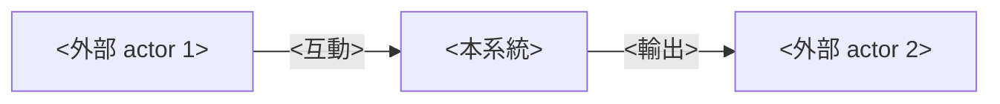
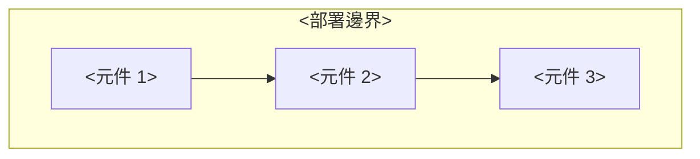
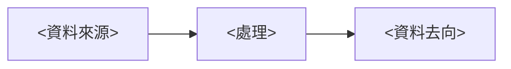

# PRD：<功能名稱>

**版本**：v0.1 draft
**Owner**：<PRD 撰寫者>，<實作工程師>（implementation backup）
**遵循**：<org 自家 PRD 撰寫 Guideline>

---

## 1. Overview & Context

<2-4 句話描述此功能的 product context — 解決什麼用戶問題、適用什麼情境、產品定位>

**Stakeholder**：<end user / 需求方 / PM / implementer 等角色>

**上下游**：
- 上游：<input source — 誰提供素材 / 需求 / 預算>
- 下游：<output recipient — 後續部署 / 客戶交付對象>

---

## 2. Goals / Non-Goals

### Goals

- **G1**：<最頂層目標 1>
- **G2**：<目標 2>
- **G3**：<目標 3>

### Non-Goals

- ❌ **不做** <明確排除的範圍 1>
- ❌ **不做** <排除範圍 2>
- ❌ **不做** <排除範圍 3>

### Constraints

- **時程**：<POC X 週 / production Y 月>
- **Hardware / Infra**：<規格 / 部署環境限制>
- **預算**：<採購 / 既有資源 / 不採購>
- **法規 / 合規**：<肖像權 / GDPR / 業界規範>
- **其他**：<授權 / 技術鎖定 / 政策>

---

## 3. User Stories & Personas

### Persona

- **<Persona 1>**：<角色描述 + 跟此系統的互動方式>
- **<Persona 2>**：<同上>
- **<Persona 3>**：<同上>

### User Stories

- **US-1**：作為 <persona>，我 <做什麼>，產生 <什麼價值>
- **US-2**：<同上>
- **US-3**：<同上>

---

## 4. Functional Requirements

### <模組 / 子系統 1>

- **FR-001**：<具體可驗證行為 1>
- **FR-002**：<具體可驗證行為 2>

### <模組 / 子系統 2>

- **FR-010**：<...>
- **FR-011**：<...>

### 失敗 fallback

- **FR-XXX**：<系統失敗 / 異常時的行為（continue gracefully / fail-safe / retry 等）>

---

## 5. Non-Functional Requirements

| 維度 | 目標 | 備註 |
|---|---|---|
| Latency / 延遲 | <量化或方向性敘述> | <備註 / 依賴 hardware> |
| Throughput / 吞吐 | <...> | <...> |
| 系統穩定性 | <...> | <...> |
| Hardware footprint | <...> | <...> |

正式 production 級的 NFR（SLO / RTO / RPO）見 §15。

---

## 6. System Architecture

### 6.1 Context Diagram



### 6.2 Container Diagram



**部署位置**：<single host / distributed / cloud / on-premise>
**Tech stack**：
- <層 1>：<選型 + 理由>
- <層 2>：<...>

### 6.3 Data Flow



---

## 7. Data Model

<是否需要 DB / 用什麼 DB / table schema 主要欄位 / 本機檔案組織等>

```
<目錄結構或 schema 範例>
```

---

## 8. API Contract

<外部介面 / 內部 component API / 是否 HTTP / WebSocket / RPC>

| Endpoint | Method | Purpose |
|---|---|---|
| `<path>` | <GET/POST/...> | <用途> |

---

## 9. Security & Privacy

- **敏感資料儲存**：<是否儲存 / 怎麼處理>
- **個資保護**：<合規依據 — GDPR / PIPL / 內部規範>
- **威脅模型**：<外部攻擊面 / 內部風險>
- **授權 / 認證**：<是否需要 / 用什麼 mechanism>

---

## 10. Observability

- **Log**：<什麼事件要 log / log 留多久 / rotate 機制>
- **Metric**：<是否上報 / 上報哪些 metric / 平台>
- **Trace**：<是否需要 distributed tracing>
- **Alert**：<什麼條件 page on-call>

---

## 11. Risks & Mitigations

| 風險 | 機率 | 衝擊 | 緩解措施 |
|---|---|---|---|
| <風險 1> | H/M/L | H/M/L | <action 1> |
| <風險 2> | H/M/L | H/M/L | <action 2> |
| <風險 3> | H/M/L | H/M/L | <action 3> |

---

## 12. Rollout & Migration Plan

- **部署方式**：<怎麼 ship 到生產>
- **回滾**：<失敗怎麼回退>
- **Staged rollout**：<是否分批 / canary / blue-green>

---

## 13. Test Strategy

### Unit
<單元測試 scope>

### Integration
<整合測試 scope>

### E2E
<端到端驗證 scope>

### 測試素材
<從哪來 / 如何準備>

---

## 14. Open Questions

| # | 問題 | 答案 / 處理 | 對誰 | 何時 confirm |
|---|---|---|---|---|
| Q1 | <問題 1> | ⏳ 待 | <stakeholder> | <時機> |
| Q2 | <問題 2> | ⏳ 待 | <stakeholder> | <時機> |
| Q3 | <問題 3> | ⏳ 待 | <stakeholder> | <時機> |

---

## 15. Appendix

### 參考文件

- <internal / external reference 1>
- <reference 2>

### 對 Guideline 的偏離（Deviation）

<如果是 POC 或特殊 scope，明列偏離 Guideline 的點 + 理由>

- **<§X.Y 條目>**：<偏離理由>
- **<§X.Y 條目>**：<偏離理由>

正式 production 階段若決定推進，須補齊 Guideline 完整章節 + ADR。

### 變更管理

PRD vX.Y draft 進 review → 鎖 v1.0 後若有變更走 ADR（Architecture Decision Record）。本 POC 階段不強制要求 ADR，但若<關鍵設計 X / Y / Z>有重大變更，建議落 ADR。
