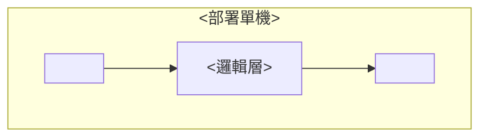

# PRD：<POC 功能名稱>

**版本**：v0.1 draft
**Owner**：<PRD 撰寫者>，<實作工程師>（implementation backup）
**遵循**：<org 自家 PRD 撰寫 Guideline>（POC 簡化套用，見 §15 Deviation）

---

## 1. Overview & Context

<2-4 句話描述此 POC 要驗證的核心 hypothesis — 解決什麼問題、用什麼路徑驗證、預期 deliverable>

**Stakeholder**：<end user / 需求方 / 實作者>

**上下游**：
- 上游：<素材 / 需求 / 既有資源來源>
- 下游：<POC 通過後的下一步 — production 評估 / pilot deploy 等>

---

## 2. Goals / Non-Goals

### Goals

- **G1**：POC 階段做出可 demo 的端到端系統
- **G2**：以模擬輸入 / 既有 hardware 驗證 <核心 pipeline>
- **G3**：建立可被 <實作者> 接手的 codebase

### Non-Goals

- ❌ **不做** production 級別 hardware spec / SLA 確認
- ❌ **不做** model fine-tune / 客製訓練（用現成方案）
- ❌ **不做** 多實例 / 雲端 dashboard / 後台統計
- ❌ **不做** 個資保護 / 法規合規（POC 不留資料）
- ❌ **不做** 軟體更新 / OTA / 自動部署

### Constraints

- **POC 預估**：<X 週>
- **Hardware**：<具體規格或既有資源>
- **預算**：<採購 / 不採購 / 既有資源>
- **法規 / 授權**：<授權狀況>

---

## 3. User Stories & Personas

### Persona

- **<End user>**：<怎麼跟系統互動>
- **<操作員>**：<啟動 / 停止 / 設定 mode>
- **<開發者>**：<dev / debug 角色>

### User Stories

- **US-1**：作為 <end user>，我 <得到什麼 demo 體驗>
- **US-2**：作為 <操作員>，我 <能做什麼控制>
- **US-3**：作為 <開發者>，我 <能用模擬輸入驗證系統>

---

## 4. Functional Requirements

### <感測層 / 輸入層>

- **FR-001**：<輸入訊號擷取 / sensor 行為>
- **FR-002**：<觸發條件 1>
- **FR-003**：<觸發條件 2>

### <處理 / 邏輯層>

- **FR-010**：<判斷邏輯 / 狀態機>
- **FR-011**：<多目標處理 / 優先序>

### <輸出 / actuator 層>

- **FR-020**：<output 行為 1>
- **FR-021**：<output 行為 2>

### 模式切換

- **FR-030**：<runtime mode 切換機制>

### 失敗 fallback

- **FR-040**：<sensor 失敗 / model 失敗 / 連線斷線時 graceful degrade>

---

## 5. Non-Functional Requirements

POC scope 不嚴格量化，列方向性需求：

| 維度 | 目標 | 備註 |
|---|---|---|
| 延遲 | 越短越好 | <hardware 限制 / 接受範圍> |
| 系統穩定性 | POC <X> 分鐘不 crash | 上路 baseline |
| Hardware footprint | <single host 跑滿 pipeline> | <是否需 GPU> |

正式 production 級的 NFR（SLO / RTO / RPO）**不適用** POC 階段，見 §15 Deviation。

---

## 6. System Architecture

### 6.1 Context Diagram

```mermaid
graph LR
  Input[<input source>] --> System[<本 POC 系統>]
  System --> Output[<output target>]
  Operator -->|<mode 控制>| System
```



### 6.2 Container Diagram



**部署位置**：<single host / local process / shared memory>
**Tech stack**：
- <層 1>：<選型理由 — POC 速度優先 / 既有資源相容>
- <層 2>：<...>
- 通訊：同 process 內 in-memory call（POC 簡化，無 IPC / WebSocket）

### 6.3 Data Flow

<簡化 mermaid 或文字描述>

---

## 7. Data Model

POC 不用 DB。本機檔案組織：

```
/<poc-name>/
  config/
    mode.json
    <param>.json
  resources/
    <input-sample>.<ext>
  models/  (若用 ML)
    <model>.<ext>
  app.<ext>  (主程式)
```

---

## 8. API Contract

POC 內部 component 同 process call，無 cross-component API。

唯一可暴露介面：<操作員 hotkey / config 檔 / CLI 參數>，無 HTTP / WebSocket / REST。

---

## 9. Security & Privacy

POC scope 對 security 採最小要求：

- **無敏感資料儲存**：<即用即丟，不寫硬碟>
- **個資保護**：<不留存使用者資料 → 不構成個資處理>
- **威脅模型 N/A**：POC 不對外網路暴露 endpoint，無 attack surface

正式 production 階段須補：<具體合規項目>

---

## 10. Observability

POC 不需 distributed tracing / metric platform。最小需求：

- **本機 log**：<觸發事件 + crash trace 寫 app.log，rotate XMB>
- **健康指標**：<啟動 banner + 心跳 log>

正式 production 階段可加 SDK 上報 metric。

---

## 11. Risks & Mitigations

| 風險 | 機率 | 衝擊 | 緩解措施 |
|---|---|---|---|
| <模型 / 演算法選錯> | H | H | POC 第一週 baseline 驗證 + 替代方案備案 |
| <hardware 跑不滿規格> | M | M | <fallback 方案> |
| <sensor / 輸入品質> | M | M | <calibration / threshold tune> |
| 時程壓力 | H | M | PRD 寫到「可被實作者接手」即可，細節留 ADR 後補 |

---

## 12. Rollout & Migration Plan

POC 階段不做 staged rollout：

- **部署方式**：把整個 `/<poc-name>/` 資料夾 + 主程式複製到目標機，手動執行
- **回滾**：POC 失敗 = 把主程式刪掉重灌舊版
- **production 上路測試**：POC 通過 dev test 後直接 ship 到 <一台目標機> 測試，不分 stage

---

## 13. Test Strategy

POC 階段三層精簡：

### Unit
- <核心 wrapper>：<input → output 結構正確>（mock dependencies）
- <state machine>：<狀態轉換正確>

### Integration
- <input → process → output> 端到端，以模擬輸入跑一輪
- mode 切換在 runtime 立即生效

### E2E（上路測試）
- 部署到目標機，實際跑 <X> 分鐘觀察：
  - <output 持續 / 觸發行為符合預期>
  - 系統不 crash

### 測試素材
<手動準備 / 既有資源 / 模擬資料>

---

## 14. Open Questions

| # | 問題 | 答案 / 處理 | 對誰 | 何時 confirm |
|---|---|---|---|---|
| Q1 | <模型 / 演算法選哪個> | ⏳ 待 baseline 結果 | <實作者> | POC 第一週 |
| Q2 | <核心觸發 threshold> | ⏳ 階段 N 實機 calibration 實測 | <PRD 撰寫者> | 階段 N |
| Q3 | <資源 / 素材數量> | ⏳ <stakeholder> 拍板 | <stakeholder> | <時機> |
| Q4 | <Hardware spec> | ⏳ spec 待確認 | <實作者> | 實機到位後 |

---

## 15. Appendix

### 參考文件

- <internal / external reference 1>
- <reference 2>

### 對 Guideline 的偏離（Deviation）

POC 短期 deliverable 對應 <org PRD Guideline> 的偏離理由：

- **§3.1 三張 C4 圖**：用 Mermaid 簡化版替代正規 C4（POC 階段不做 layered diagram）
- **§3.4 量化 NFR**：POC 不適用 SLO 99.9% 等指標，改方向性敘述
- **§4.1 不可變性**：POC 不用 event sourcing
- **§4.5 可觀測性**：POC 純本機 log，不上 trace_id / golden signals
- **§7 測試覆蓋率 80%**：POC 階段不強制覆蓋率，重點在 E2E 上路測試
- **<§X.Y 其他條目>**：<偏離理由 — 行業特化 / scope 不適用 / 時程不允許等>

正式 production 階段若決定推進，須補齊 Guideline 完整章節 + ADR。

### 變更管理

PRD v0.x draft 期間隨工作流調整；鎖 v1.0 後若有變更走 ADR。本 POC 階段不強制要求 ADR，但若 <核心設計 X> / <選型 Y> 有重大變更，建議落 ADR。
