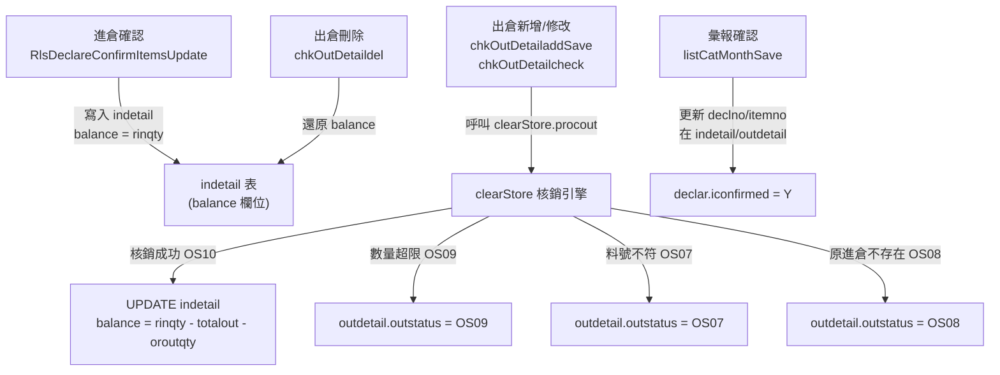
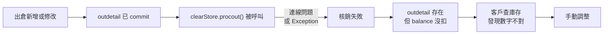
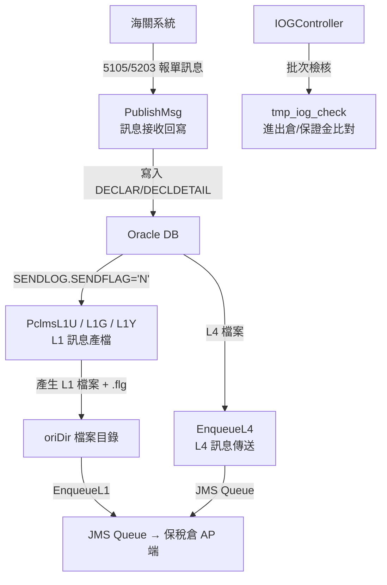

# Session Recap：PCLMS_AP庫存核銷手動調整根因清查

## 任務背景

使用者要求檢視 Claude 產出的 `inventory_writeoff_analysis.md`，判斷其對 PCLMS 庫存核銷問題是否不夠全面，並進一步針對 `PCLMS_AP` 深度清查所有可能造成客戶常需手動調整庫存的原因。

本次依 PixiuCore / PCLMS context 啟動，工作性質為唯讀分析，未修改 PCLMS_AP 原始碼，未執行測試。

## 本次完成

1. 審閱 Claude 報告，確認其有抓到 `clearStore` 交易拆分、每筆 commit、刪除只還原 OS10、月彙報 key 同步、浮點精度、BK 訊息處理等主方向。
2. 針對 `PCLMS_AP` 重新盤點 `clearStore.java` 核銷公式、狀態判斷、例外處理、commit/rollback 邊界。
3. 擴大清查出倉 CRUD、進倉修改、按月彙報、加工、報廢、測試/退料等會直接或間接改 `indetail.balance` / `outdetail.outstatus` 的流程。
4. 找出 Claude 漏掉或深度不足的高風險點：多處「先 commit 後核銷」、`errlog()` 在核銷前且可能阻斷流程、進倉流程直接覆寫 balance、月彙報 key 漂移，以及 `chkOutDetailaddSave` 疑似 SQL placeholder 錯誤。
5. 收斂出後續查證順序：先以 SQL 比對 `outdetail` 非 OS10 但可核銷、`indetail.balance` 與公式重算差異、月彙報 key mismatch、以及新增/修改出倉後未成功 OS10 的案例。

## 主要結論

### 核心根因

PCLMS_AP 的庫存餘額不是單一來源計算，而是混合了多種寫入模式：

- `clearStore` 依 `outdetail` / `indetail` / `back` / `testitem` 重算 balance。
- 出倉修改與刪除流程會手動還原 balance。
- 進倉修改流程會直接設定或差額更新 balance。
- 月彙報流程會改變核銷 key，例如 `declno`、`itemno`、`odeclno`、`oitemno`。
- 加工、報廢、測試、退料流程也可能直接改 balance 或新增待核銷 outdetail。

因此客戶常手動調整庫存，最可能不是單一 outstatus 判斷錯，而是交易邊界與資料所有權不清楚造成的長期技術債。

### 高風險發現

1. 多數流程會先 commit 資料，再呼叫 `clearStore.procout()` 或 `procout2()`；核銷失敗時，前段 commit 已無法 rollback。
2. `chkOutDetailaddSave.java` 的 `sqlctmcode` 沒有 `?` placeholder，卻呼叫 `stmt.setString(1..3)`；若該路徑執行，可能在 outdetail commit 後、clearStore 前丟 SQLException。
3. 多個流程在核銷前呼叫 `clearStore.errlog()`；log path、權限或 I/O 失敗會阻斷核銷。
4. `chkInDetailcheck.java` 可直接用 request 的 `newbalance` 覆寫 `indetail.balance`，不是由核銷公式重算。
5. `chkInDetailModifySave.java` / `chkInDetailModifyAllSave.java` 有複雜拆分與搬移邏輯，需用實際案例確認是否會產生 balance 半套更新。
6. `CancelMonth.java` 與 `RlsCatMonth_Return.java` 對月彙報取消/回復處理完整度不同，可能造成核銷 key 半套回復。
7. `clearStore` 精準匹配依賴 `bondno + declno/odeclno + itemno/oitemno + inpost/outpost + unit + prdtno`，任何 key 漂移都會造成 OS08 / OS07 / OS12。
8. `clearStore` 使用 per-row commit，單張單據可能局部成功、局部失敗。
9. `clearStore` 找不到精準進倉時有 `rs.wasNull()` 用錯 ResultSet 的問題。
10. `calQty` 使用 double 與 4 位小數格式化，且例外時回傳 0，可能製造安靜的庫存偏差。

## 可能原因總結

本次清查後，造成客戶常需要手動調整庫存的可能原因可分成六類：

1. **交易邊界不完整**：多個流程先 commit `outdetail` / `indetail`，再呼叫 `clearStore` 核銷；核銷失敗時，前段資料已落庫，rollback 無法補救。
2. **核銷前置步驟會中斷主流程**：`clearStore.errlog()` 在核銷前執行，若 log 路徑、權限或 I/O 失敗，可能導致資料已 commit 但核銷未執行。
3. **庫存餘額有多個寫入來源**：`balance` 不只由 `clearStore` 重算，也會被進倉修改、出倉刪除/修改、月彙報、加工、報廢、測試/退料流程直接或差額更新。
4. **核銷 key 容易漂移**：`clearStore` 依賴 `bondno`、`declno/odeclno`、`itemno/oitemno`、`inpost/outpost`、`unit`、`prdtno` 等欄位精準匹配；月彙報或手動修改若只更新部分欄位，就可能變成 OS08 / OS07 / OS12。
5. **部分流程存在明確程式風險**：例如 `chkOutDetailaddSave` 的 SQL placeholder 疑似錯誤、`clearStore` 的 `wasNull()` ResultSet 使用錯誤、進倉修改流程有複雜拆分/搬移邏輯，這些都可能製造半套更新。
6. **數量計算與併發保護不足**：`calQty` 使用 double 與 4 位小數格式化，例外時回傳 0；`static synchronized` 只能保護單一 JVM，無法防止多節點或其他 servlet 同時改同一筆庫存。

整體而言，這不是單純「某一筆出倉沒扣」的問題，而是庫存交易一致性不足：同一個庫存餘額同時被多條流程維護，且缺少單一可信的交易邊界與重算機制。

## 建議調整方向

建議不要一開始就大改 schema，而是用分階段修繕方式處理：

1. **先補資料診斷 SQL**：建立固定查詢，比對 `outdetail` 非 OS10 但可核銷、`indetail.balance` 與公式重算不一致、月彙報 key mismatch、以及最近手動調整案例。
2. **先修高確定 bug**：優先確認並修正 `chkOutDetailaddSave` SQL placeholder、`clearStore` `wasNull()` ResultSet、`calQty` 例外回傳 0 等低範圍高收益問題。
3. **移除核銷前的非必要 I/O 依賴**：`errlog()` 不應阻斷庫存交易；建議改成失敗不影響核銷，或把 log 失敗降級處理。
4. **統一交易邊界**：將「寫入/修改出入倉資料」與「clearStore 核銷」納入同一個 transaction；至少先從新增出倉、修改出倉、加工出倉、報廢出倉這些高頻入口開始。
5. **建立 balance 重算服務**：將 `clearStore` 的餘額公式整理成可重算、可比對、可批次修復的服務，避免每個 servlet 自己直接改 `balance`。
6. **收斂直接改 balance 的入口**：進倉修改、出倉刪除、月彙報回復等流程應改成呼叫同一套庫存服務，不再各自寫 SQL 調整 `indetail.balance`。
7. **加上最小測試防線**：至少針對新增出倉成功、核銷失敗 rollback、修改出倉還原再核銷、月彙報 key 回填、刪除 OS10 還原這幾條主流程建立自動化測試。
8. **導入事後對帳批次**：短期內可先做 nightly reconciliation，把疑似不一致清單輸出給維運確認，降低客戶靠手動經驗找問題的成本。

優先序建議是：先診斷資料，再修明確 bug，接著收交易邊界，最後才整理共用庫存服務。這樣比較符合舊系統翻修節奏，可以降低一次動太大的風險。

## 建議後續順序

1. 先用 SQL 找出 `outdetail.outstatus <> 'OS10'` 但對應 `indetail` 存在且理論上可核銷的資料。
2. 以 `indetail.rinqty - OS10 outdetail - testitem + back` 重算 balance，找出與 `indetail.balance` 不一致的存倉。
3. 針對最近手動調整案例，回查是否落在新增出倉、修改出倉、進倉修改、按月彙報、加工或報廢流程。
4. 檢查 `errlog` 路徑/權限與核銷前 log I/O 是否有失敗紀錄。
5. 優先修正交易邊界：將 outdetail/indetail 寫入與 clearStore 核銷包進同一交易，避免 commit 後才核銷。
6. 再修正 `chkOutDetailaddSave` SQL placeholder、`clearStore` ResultSet wasNull、數量計算與月彙報 key 同步問題。

## 重要判斷

Claude 報告的方向可用，但不夠全面。它偏重 `clearStore` 與少數 AP/BK 點，沒有完整覆蓋所有會改 `balance/outstatus` 的 AP 入口，也低估了 `errlog()`、進倉直接調整、月彙報 key 漂移與交易邊界設計的影響。

本次清查後，應把問題定位為「庫存交易一致性與資料所有權」問題，而不是單純核銷公式 bug。

## 原分析檔流程圖

以下流程圖取自 Claude 原始分析檔，保留作為來源視覺化脈絡；本次 Codex 深查的補充結論仍以上方章節為準。

### 圖 1：庫存核銷流程概覽

來源：`C:\Users\7010\.gemini\antigravity\brain\28f6124c-a248-4c1c-a98d-7c4377e501da\inventory_writeoff_analysis.md` line 10

### 圖 2：最可能造成「客戶總是要手動調整」的根因推測

來源：`C:\Users\7010\.gemini\antigravity\brain\28f6124c-a248-4c1c-a98d-7c4377e501da\inventory_writeoff_analysis.md` line 209

### 圖 3：BK 端系統架構

來源：`C:\Users\7010\.gemini\antigravity\brain\28f6124c-a248-4c1c-a98d-7c4377e501da\inventory_writeoff_analysis.md` line 235

