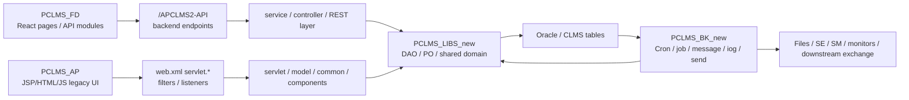

# gravityTest 專案模組與資料流盤點索引

本索引承接 2026-06-08 的全專案分析，將後續深入文件改成「依專案、依月份、依模組」存放。
本輪先落地 PCLMS 家族第一批，因為它是 gravityTest 中最大、跨 AP/BK/LIBS/FD 的核心業務群。

## 範圍

母體不分析：pixiu-core。

非母體專案共 22 個：

| 序 | 專案 | 本輪狀態 |
|---:|---|---|
| 1 | blankP | 已寫入 batch 4 模組盤點；技能/benchmark 工具包 |
| 2 | claude-parity-skills-package | 已寫入 batch 4 模組盤點；Markdown skill package |
| 3 | PCLMS_AP | 已寫入 batch 1 模組盤點 |
| 4 | pclms_ap_tmp | 已寫入 batch 4 模組盤點；PCLMS AP 片段/tmp |
| 5 | PCLMS_BK_new | 已寫入 batch 1 模組盤點 |
| 6 | pclms_bk_tmp | 已寫入 batch 4 模組盤點；PCLMS BK 連線片段/tmp |
| 7 | PCLMS_FD | 已寫入 batch 1 模組盤點 |
| 8 | PCLMS_LIBS_new | 已寫入 batch 1 模組盤點 |
| 9 | pepis_ap | 已寫入 batch 2 模組盤點 |
| 10 | perms | 已寫入 batch 2 模組盤點 |
| 11 | PFTZB | 已寫入 batch 3 模組盤點；修正舊登錄的空專案判斷 |
| 12 | PFTZC_AP_new | 已寫入 batch 3 模組盤點 |
| 13 | PFTZC_BK | 已寫入 batch 3 模組盤點 |
| 14 | PFTZC_LIBS | 已寫入 batch 3 模組盤點 |
| 15 | pisso_ap | 已寫入 batch 2 模組盤點 |
| 16 | pixiu-auto-research | 已寫入 batch 4 模組盤點；研究/候選評估工具 |
| 17 | PPOST | 已寫入 batch 3 模組盤點；大型 C# 專案群 |
| 18 | ProjectCreater | 已寫入 batch 4 模組盤點；Next.js 專案產生器 |
| 19 | psaab | 已寫入 batch 4 模組盤點；SAAB legacy web assets/filter |
| 20 | PTWCS | 已寫入 batch 4 模組盤點；注意 config/credential 類檔案只記風險不摘錄秘密 |
| 21 | tv-isso-api | 已寫入 batch 2 模組盤點；pom.xml 仍以 raw source 驗證為主 |
| 22 | tv-isso-api-doc | 已寫入 batch 2 模組盤點；Javadoc/文件型專案 |

## 已寫入文件

| 專案 | 文件 |
|---|---|
| PCLMS_AP | vault/projects/gravityTest/projects/PCLMS_AP/2026-06/2026-06-08-module-flow-inventory.md |
| PCLMS_BK_new | vault/projects/gravityTest/projects/PCLMS_BK_new/2026-06/2026-06-08-module-flow-inventory.md |
| PCLMS_LIBS_new | vault/projects/gravityTest/projects/PCLMS_LIBS_new/2026-06/2026-06-08-module-flow-inventory.md |
| PCLMS_FD | vault/projects/gravityTest/projects/PCLMS_FD/2026-06/2026-06-08-module-flow-inventory.md |
| perms | vault/projects/gravityTest/projects/perms/2026-06/2026-06-08-module-flow-inventory.md |
| pepis_ap | vault/projects/gravityTest/projects/pepis_ap/2026-06/2026-06-08-module-flow-inventory.md |
| pisso_ap | vault/projects/gravityTest/projects/pisso_ap/2026-06/2026-06-08-module-flow-inventory.md |
| tv-isso-api | vault/projects/gravityTest/projects/tv-isso-api/2026-06/2026-06-08-module-flow-inventory.md |
| tv-isso-api-doc | vault/projects/gravityTest/projects/tv-isso-api-doc/2026-06/2026-06-08-module-flow-inventory.md |
| PFTZB | vault/projects/gravityTest/projects/PFTZB/2026-06/2026-06-08-module-flow-inventory.md |
| PFTZC_AP_new | vault/projects/gravityTest/projects/PFTZC_AP_new/2026-06/2026-06-08-module-flow-inventory.md |
| PFTZC_BK | vault/projects/gravityTest/projects/PFTZC_BK/2026-06/2026-06-08-module-flow-inventory.md |
| PFTZC_LIBS | vault/projects/gravityTest/projects/PFTZC_LIBS/2026-06/2026-06-08-module-flow-inventory.md |
| PPOST | vault/projects/gravityTest/projects/PPOST/2026-06/2026-06-08-module-flow-inventory.md |
| PTWCS | vault/projects/gravityTest/projects/PTWCS/2026-06/2026-06-08-module-flow-inventory.md |
| psaab | vault/projects/gravityTest/projects/psaab/2026-06/2026-06-08-module-flow-inventory.md |
| ProjectCreater | vault/projects/gravityTest/projects/ProjectCreater/2026-06/2026-06-08-module-flow-inventory.md |
| pixiu-auto-research | vault/projects/gravityTest/projects/pixiu-auto-research/2026-06/2026-06-08-module-flow-inventory.md |
| blankP | vault/projects/gravityTest/projects/blankP/2026-06/2026-06-08-module-flow-inventory.md |
| claude-parity-skills-package | vault/projects/gravityTest/projects/claude-parity-skills-package/2026-06/2026-06-08-module-flow-inventory.md |
| pclms_ap_tmp | vault/projects/gravityTest/projects/pclms_ap_tmp/2026-06/2026-06-08-module-flow-inventory.md |
| pclms_bk_tmp | vault/projects/gravityTest/projects/pclms_bk_tmp/2026-06/2026-06-08-module-flow-inventory.md |

## PCLMS 家族總資料流

## 本輪 CodeGraph 驗證

| 專案 | CodeGraph 狀態 |
|---|---|
| PCLMS_AP | 756 files, 17,332 nodes, Java 642, JavaScript 98 |
| PCLMS_BK_new | 654 files, 15,439 nodes, Java 626 |
| PCLMS_LIBS_new | 289 files, 8,886 nodes, Java 289 |
| PCLMS_FD | 823 files, 20,399 nodes, Java 722, JavaScript 101 |
| perms | 701 files, 27,238 nodes, Java 291, JavaScript 268, TypeScript 123 |
| pepis_ap | 1,406 files, 34,416 nodes, Java 1,186, JavaScript 176, Vue 41 |
| pisso_ap | 767 files, 4,445 nodes, Java 102, JavaScript 643, PHP 22 |
| tv-isso-api | 33 files, 632 nodes, Java 33 |
| tv-isso-api-doc | 0 files, 0 nodes; Javadoc/HTML 文件型專案 |
| PFTZB | 1,152 files, 24,452 nodes, Java 984, JavaScript 158 |
| PFTZC_AP_new | 888 files, 27,811 nodes, Java 553, JavaScript 317 |
| PFTZC_BK | 552 files, 17,610 nodes, Java 531 |
| PFTZC_LIBS | 234 files, 7,950 nodes, Java 229 |
| PPOST | 550 files, 11,375 nodes, C# 545 |
| PTWCS | 1,074 files, 15,310 nodes, Java 681, JavaScript 361, JSX 5 |
| psaab | 140 files, 541 nodes, JavaScript 138, Java 2 |
| ProjectCreater | 33 files, 247 nodes, TSX 17, TypeScript 13 |
| pixiu-auto-research | 9 files, 97 nodes, JavaScript 8 |
| blankP | 8 files, 56 nodes, Python 5, YAML 3 |
| claude-parity-skills-package | 0 files, 0 nodes; Markdown skill package |
| pclms_ap_tmp | 8 files, 175 nodes, Java 7, JavaScript 1 |
| pclms_bk_tmp | 1 file, 10 nodes, Java 1 |

補充：PCLMS_FD 雖然名稱像 frontend，但 CodeGraph 顯示它同時包含 Java 與 JavaScript；不可只當純前端專案處理。

## 後續批次建議

1. batch 2：perms、pepis_ap、tv-isso-api、tv-isso-api-doc、pisso_ap。已完成本輪模組盤點。
2. batch 3：PFTZB、PFTZC_AP_new、PFTZC_BK、PFTZC_LIBS、PPOST。已完成本輪模組盤點。
3. batch 4：PTWCS、psaab、ProjectCreater、pixiu-auto-research、blankP、claude-parity-skills-package、tmp 專案判讀。已完成本輪模組盤點。

## 分析限制

本索引是批次進度控制文件，不取代各專案的 source-backed 模組盤點。
若後續發現 tmp 專案其實是正式分支、備援版本或可刪除暫存，需另行在索引中修正狀態。

## 完成狀態

2026-06-08 已完成 22 個非母體專案的 module-flow-inventory 文件。每份文件皆含模組功用、資料流、牽涉程式/檔案、CodeGraph 或 manifest 佐證與下一步。
