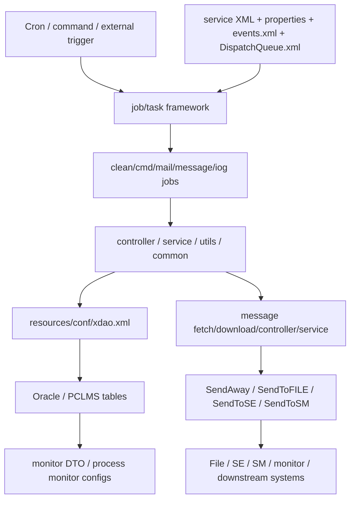

# PCLMS_BK_new 模組功用、資料流與牽涉程式

## 專案定位

PCLMS_BK_new 是 PCLMS 的批次、排程、訊息、交換與背景處理層。
它不像 AP 以使用者網頁為主要入口，而是以 cron/task/job、message fetch/download、iog、send、monitor 等背景流程為核心。

CodeGraph 本輪確認：654 indexed files, 15,439 nodes；主要語言為 Java 626 檔。

## 模組功用與牽涉程式

| 模組 | 功用 | 牽涉程式/路徑 |
|---|---|---|
| 排程與 task framework | 定義 cron/task/job 執行框架，承接時間觸發與命令觸發 | com/tradevan/clms/job/task/CommonTask.java；Task.java；TaskCommand.java；TaskContext.java；TaskLaunch.java；CronTask.java；CronTaskService.java；TimeTaskJob.java |
| CommonCron/ClDoc service XML | Spring/service 層排程設定與任務配置 | src/main/resources/service/CommonCronTaskService.xml；ClDocTaskService.xml |
| 清理與維運 job | 清理宣單、進出資料、log、L6/T1、使用者活動與其他維運資料 | com/tradevan/clms/job/clean/CleanDeclarService.java；CleanInOutData*；CleanJob.java；CleanJobs.java；CleanL6T1Service.java；CleanLogService.java；CleanUserActi* |
| 命令/系統狀態 job | 啟停或檢查 L1/L4/L6/OxAP 等背景狀態 | com/tradevan/clms/job/cmd/JobComs.java；KillL1Job.java；KillL4Job.java；KillL6Job.java；OxAPstatusJob.java；ShellUtils.java |
| 訊息處理 message | 處理 download/fetch/controller/service/bean/base/contract 等訊息流 | com/tradevan/clms/message/download；fetch；controller；service；bean；base；contract |
| IOG 流程 | 處理 IOG DTO、controller、service、implementation | com/tradevan/clms/iog/IOCDto.java；IOGController.java；IOGService.java；IOGServiceImpl.java |
| Send 模組 | 將處理結果送往 file、SE、SM 等外部或交換端 | com/tradevan/clms/send/SendAway.java；SendToFILE.java；SendToSE.java；SendToSM.java |
| Domain/service/common | 共用 DTO、controller、service、utils、grntCheck 等後端邏輯 | com/tradevan/clms/controller；dto；service；utils；common；grntCheck |
| 協議/線別設定 | 不同線別或交換流程的 properties | resources/FTZL6/FTZL6.properties；FTZL5/FTZL5.properties；L9/L9.properties；FTZL4/FTZL4.properties；L8/L8.properties；CLMSL4/PCLMS_L4*.properties；TS/TS.properties |
| 事件/佇列/DB 設定 | 事件、dispatch queue、xdao 與 application config | resources/conf/events.xml；DispatchQueue.xml；xdao.xml；application.xml；logging.xml |

## 主要資料流

## 與其他 PCLMS 專案關係

| 關係 | 說明 |
|---|---|
| 對 PCLMS_AP | AP 產生或維護的資料，可由 BK 排程或訊息流程後續交換、清理、監控 |
| 對 PCLMS_LIBS_new | BK 應共用 LIBS 的 DAO/PO/domain 模型；實際呼叫需逐 job 追 import 與 xdao |
| 對 PCLMS_FD | FD/API 層若觸發批次或查詢批次結果，最終會碰到 BK job/message/send 的狀態或輸出 |

## 盤點限制與下一步

本文件已完成 job/message/iog/send/config 第一層盤點。
下一步建議從 CommonCronTaskService.xml、ClDocTaskService.xml、DispatchQueue.xml 逐項列出 task name、bean/class、觸發條件、輸入表、輸出表、外送端點。
