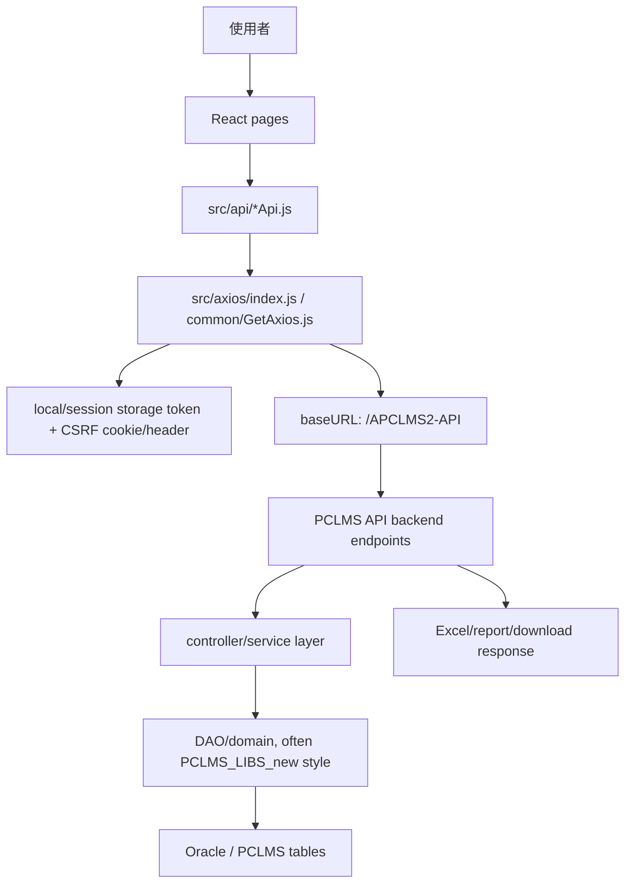

# PCLMS_FD 模組功用、資料流與牽涉程式

## 專案定位

PCLMS_FD 是 PCLMS 的新式前端/整合專案之一，包含 React 前端 src，也包含 Java 程式碼。
本輪先盤點 React 入口、頁面分類、API client 與 Axios 資料流；Java 後端部分需下一輪再依 controller/service/DAO 深追。

CodeGraph 本輪確認：823 indexed files, 20,399 nodes；Java 722 檔、JavaScript 101 檔。

## 模組功用與牽涉程式

| 模組 | 功用 | 牽涉程式/路徑 |
|---|---|---|
| React 入口 | 掛載 App、初始化前端應用 | pclms_fd/src/index.js；pclms_fd/src/App.js |
| Route | 控制頁面路由與功能入口 | pclms_fd/src/route/routeConfig.js |
| Store/Reducer/Context | 前端狀態管理與跨頁共用狀態 | pclms_fd/src/store/index.js；src/reducer；src/context/AppProvider.js |
| Axios 共用層 | 設定 baseURL、token、CSRF、request/response interceptor | pclms_fd/src/axios/index.js；src/common/GetAxios.js |
| Pages | 依業務分類的畫面：common、declar、grnt、information、logistics、other、report、stock、system | pclms_fd/src/pages/* |
| API clients | 各功能呼叫後端 API 的封裝 | pclms_fd/src/api/*Api.js；AuthService.js；authheader.js；announce.js |
| Stock/庫存 | 查詢庫存、下載 Excel、計算 balance | stockApi.js：/stock/v1/fetchStock；/stock/v1/stockExcel；calculateBalance |
| Goods balance/report | 查詢貨品結餘與 Excel | goodsBalanceApi.js：/goodsbalance/v1/fetchGoodsBalance；/goodsbalance/v1/goodsBalanceExcel |
| Grnt/保證金 | 查詢/更新/新增保證金帳務與異動紀錄 | grntApi.js：/grnt/v1/fetchGrntBill；updateGrntBill；createGrntBill；fetchGrntModlog；downloadGrntModlog |
| Out N Months | 查詢與匯出 N 月未出倉等報表 | outNMonthsApi.js：/outnmonths/v1/fetchOutNMonths；/outnmonths/v1/outNMonthsExcel |
| Auth | 登入、授權 header、auth action | AuthService.js；authheader.js；authActionApi.js |

## 主要資料流

## API 對照重點

| 業務頁/功能 | API module | 後端路徑線索 |
|---|---|---|
| 庫存 | stockApi.js | /stock/v1/fetchStock；/stock/v1/stockExcel |
| 貨品結餘 | goodsBalanceApi.js | /goodsbalance/v1/fetchGoodsBalance；/goodsbalance/v1/goodsBalanceExcel |
| 保證金 | grntApi.js | /grnt/v1/fetchGrntBill；/grnt/v1/updateGrntBill；/grnt/v1/createGrntBill |
| 保證金異動紀錄 | grntApi.js | /grnt/v1/fetchGrntModlog；/grnt/v1/downloadGrntModlog |
| N 月未出倉 | outNMonthsApi.js | /outnmonths/v1/fetchOutNMonths；/outnmonths/v1/outNMonthsExcel |
| 報單 | declarInfoApi.js | 下一輪需追 module 內 export function 與 backend controller |
| 日常作業 | dailyworkApi.js | 下一輪需追實際 endpoint |
| 批次 | batchjobApi.js | 下一輪需連到 PCLMS_BK_new job/task |
| 公用代碼/客戶/倉庫/車輛 | commonApi.js；briefCodeApi.js；customerApi.js；warehseApi.js；vehicleApi.js | 下一輪需連到 controller/DAO |

## 盤點限制與下一步

本文件先完成 React/API client 資料流盤點。
下一步應以 API path 反查 Java controller/service，再串到 DAO/SQL：例如 /stock/v1/fetchStock -> backend controller -> service -> DAO/domain -> table。
另需把 Java 722 檔另外拆成 backend module inventory，不可只以 React src 判定專案全貌。
