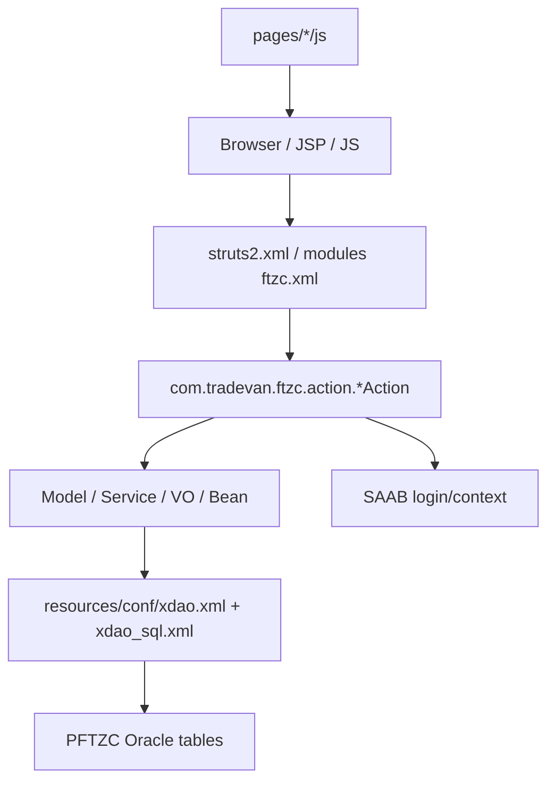

# PFTZC_AP_new 模組功用、資料流與牽涉程式

## 專案定位

PFTZC_AP_new 是 PFTZC 的 AP/Web 層，採 Struts/JSP + Java action/model/service + xdao/SAAB config。它處理登入、系統/使用者維護、盤點、報單、報廢、BOM/帳冊等互動式作業。

CodeGraph 本輪確認：888 indexed files, 27,811 nodes；Java 553、JavaScript 317。

## 模組功用與牽涉程式

| 模組 | 功用 | 牽涉程式/路徑 |
|---|---|---|
| Maven/Web config | Web app、Struts、Tiles、menu、SAAB、xdao、logging | JAVA/pftzc_mvn/pom.xml；WEB-INF/web.xml；tiles.xml；menu-config.xml；resources/conf/struts2.xml；xdao.xml；application_context_saab.xml |
| Login/使用者 | 登入、登入錯誤次數/鎖定、SAAB 使用者資料 | action/LoginAction.java；pages/user/login.jsp；pages/user/js/login.js；pages/userMtn/* |
| 系統維護 | 使用者、海關/客戶、公告/board、權限類頁面 | pages/sys/User*.jsp；Custom*.jsp；Board*.jsp |
| 盤點/帳冊 | 年度盤點、BOM/BOMD、庫存帳冊與動態用料 | action/InvMtnAction.java；InvModel；pages/invtry 或相關 JSP |
| 報廢 | Scrap 建立、查詢、列印、明細 | pages/scrap/Scrap*.jsp；IndtlList.jsp |
| 前端共用 JS | validate、ajax、dialog、calendar、angular、struts2 jquery | src/main/webapp/js；pages/*/js |
| 監控 | WebMon-PFTZC | src/main/webapp/MON/WebMon-PFTZC.jsp |
| 環境/部署 | deploy action、env pro/test/ver 設定 | chgVER/deploy-action.xml；env/*/conf/*.xml |

## 主要資料流

## 已驗證例子

| 功能 | 程式 | 觀察 |
|---|---|---|
| 登入 | LoginAction.login()；pages/user/js/login.js | 前端檢核 usrId/usrPwd；後端 LoginService.login 後查錯誤次數、鎖定門檻、登入紀錄 |
| 盤點 | InvMtnAction.inventory() | delete BOM/BOMD、truncate bompartmulti、insertBOM、依 cocompany 處理國瑞/非國瑞，再更新小計/總計 |
| DB/config | resources/conf/xdao.xml；xdao_sql.xml | 作業資料流最終落到 xdao/Oracle |

## 盤點限制與下一步

本文件先完成 AP 第一層模組。
下一步應從 struts2.xml 與 conf/modules/ftzc.xml 產生「action name -> Action class -> JSP -> model/xdao SQL」矩陣，並與 PFTZC_BK 的批次/訊息結果對接。
