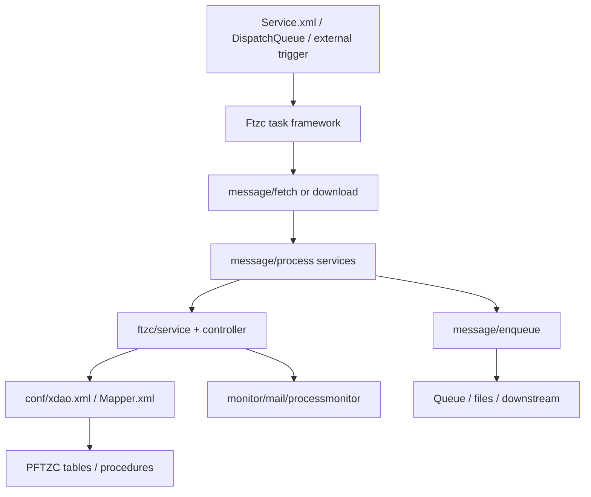

# PFTZC_BK 模組功用、資料流與牽涉程式

## 專案定位

PFTZC_BK 是 PFTZC 的背景批次、訊息交換、排程、佇列與監控層。根 pom 下含 JAVA/FTZC_BK、JAVA/process_monitor_mvn、JAVA/jks，與 PCLMS_BK_new 類似有 AP/BK 分離與部署/監控子模組。

CodeGraph 本輪確認：552 indexed files, 17,610 nodes；Java 531。

## 模組功用與牽涉程式

| 模組 | 功用 | 牽涉程式/路徑 |
|---|---|---|
| Config/queue | xdao、Service、Mapper、DispatchQueue、Event、application、各環境設定 | src/main/resources/conf/xdao.xml；Service.xml；Mapper.xml；DispatchQueue.xml；Event.xml；application.xml |
| FTZL properties | L4/L5/L6/L8 等線別/訊息設定 | resources/FTZL4；FTZL5；FTZL6；FTZL8；L8 |
| Task framework | 定期/批次 task 執行與狀態 | common/task/TaskLaunch.java；TaskStart.java；TaskInterrupt.java；task/FtzcPeriodTaskService.java；FtzcPeridTask.java |
| Fetch/download | 從外部/queue/檔案取回 L4/L5/L6/L8/N1/F3/F0 等資料 | message/fetch/controller/*；message/fetch/service/*；message/download/controller/* |
| Process | 解析、轉換、呼叫 procedure、處理 N1/F3/TLF1/TLF2/L6/L8 | message/process/controller/*；message/process/service/* |
| Enqueue/send | 產生/送出 F1、TLF2 result 等 queue 或檔案 | message/enqueue/service/TLF2ResultEnqueueServiceImpl.java；F1EnqueueServiceImpl.java；message/send/f1/service/FtzcF1ClsndService.java |
| Service/controller | AutoClear、Balance、Grntbill、Monitor、Mail、RecoveryDeclar、ReleaseQue | controller/Ftzc*.java；service/Ftzc*.java；AutoClearService.java；BalanceService.java |
| SCT service | shell/control/monitor 類服務 | com/tradevan/sct/*.java |
| process monitor/jks | 流程監控與部署/SCT scripts | JAVA/process_monitor_mvn；JAVA/jks；resources/com/tradevan/processmonitor/action/*.properties |

## 主要資料流

## 已驗證例子

| 功能 | 程式 | 觀察 |
|---|---|---|
| TLF2 result enqueue | TLF2ResultEnqueueServiceImpl.enqueue() | 掃 oriDir 中 .flg 對應檔，解析 bfno/sendId，透過 QueEnqServiceVo 與 DbFactory.open() 入 queue |
| F1 enqueue | F1EnqueueServiceImpl.enqueue() | 依檔名 substring 取 bfno，查 sendId 後 enq |
| Daily/period task | FtzcPeriodTaskService；FtzcTLF2ProcTask；FtzcN1AFetchTask | 以 task class 對應批次線路 |

## 盤點限制與下一步

下一步應把 Service.xml/DispatchQueue.xml 與 task/controller/service class 完整對照，列出每條線別的輸入目錄、輸出目錄、queue、procedure、錯誤處理與監控郵件。
