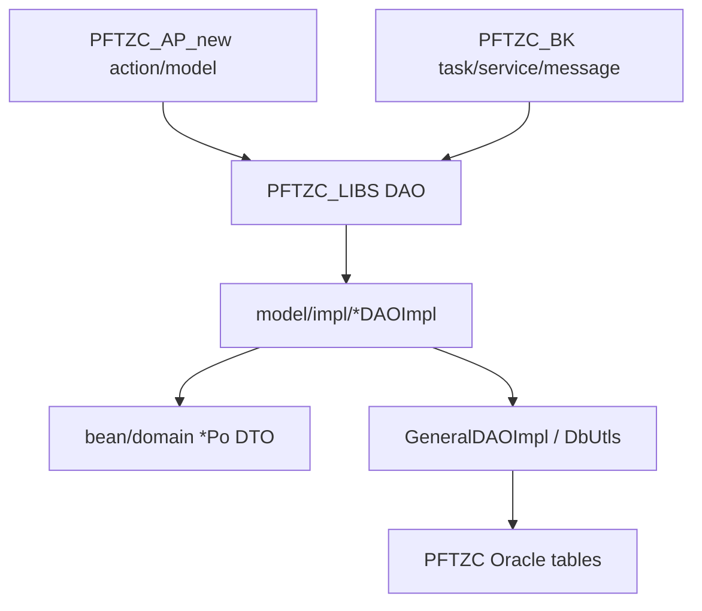

# PFTZC_LIBS 模組功用、資料流與牽涉程式

## 專案定位

PFTZC_LIBS 是 PFTZC 的共用 Java library，提供 DAO/interface/impl、PO/domain/DTO、共用 utils。它支撐 PFTZC_AP_new 與 PFTZC_BK 的資料模型與 DB 存取。

CodeGraph 本輪確認：234 indexed files, 7,950 nodes；Java 229。

## 模組功用與牽涉程式

| 模組 | 功用 | 牽涉程式/路徑 |
|---|---|---|
| DAO interface | 定義資料存取介面 | model/*DAO.java；BalanceDAO.java；DeclarDAO.java；BomDAO.java；InvtrybookDAO.java |
| DAO implementation | 對應表名、MapConverter、GeneralDAOImpl | model/impl/*DAOImpl.java；BalanceDAOImpl.java；DeclarDAOImpl.java |
| PO/Bean | 對應資料表欄位與業務資料 | bean/*Po.java；bean/I*Po.java；domain/*Po.java |
| Balance/Baldtl | 帳冊/結餘/明細資料 | BalanceDAO/Po；BalanceTDAO/Po；BaldtlDAO/Po；BaldtlTDAO/Po |
| Declar/Decldtl | 報單、報單明細、T1、設定 | DeclarDAO/Po；DecldtlDAO/Po；DeclT1DAO/Po；DeclsettingDAO/Po |
| BOM/Product/Inventory | BOM、產品、庫存帳、盤點報表 | BomDAO；BomdtlDAO；ProductDAO；InvtrybookDAO；InvtrybomDAO；InvtryrptDAO |
| TL/F1/F2/N1/L6 | 訊息/交換資料與結果 log | TlF1dataDAO；TlF2dataDAO；TlF2dataResultDAO；N1BT1DAO；L6T1DAO；FtzcF1ClsndModel |
| 系統/批次/log | syscode、task log、proc log、mod log、user action | SyscodeDAO；TaskLogDAO；ProcLogDAO；ModlogDAO；UserActionDAO |
| Utils/DTO | DB/utils、timestamp、Grntbill/F1 DTO | CommUtils.java；DbUtls.java；TimestampUtils.java；dto/GrntbillDTO.java；domain/FtzcF1*.java |

## 主要資料流

## 已驗證例子

| DAO | Impl | 表/資料域 |
|---|---|---|
| BalanceDAO | BalanceDAOImpl | TABLENAME = BALANCE |
| DeclarDAO | DeclarDAOImpl | TABLENAME = DECLAR |
| TlF2dataDAO | TlF2dataDAOImpl | TLF2 訊息資料 |
| FtzcF1ClsndModel | FtzcF1ClsndModelImpl | F1 clsnd DTO/model |

## 盤點限制與下一步

下一步應用 CodeGraph callers/impact 反查每個 DAO 被 AP/BK 哪些 action/task/service 使用，建立「DAO -> 使用模組 -> table -> 流程」矩陣。
