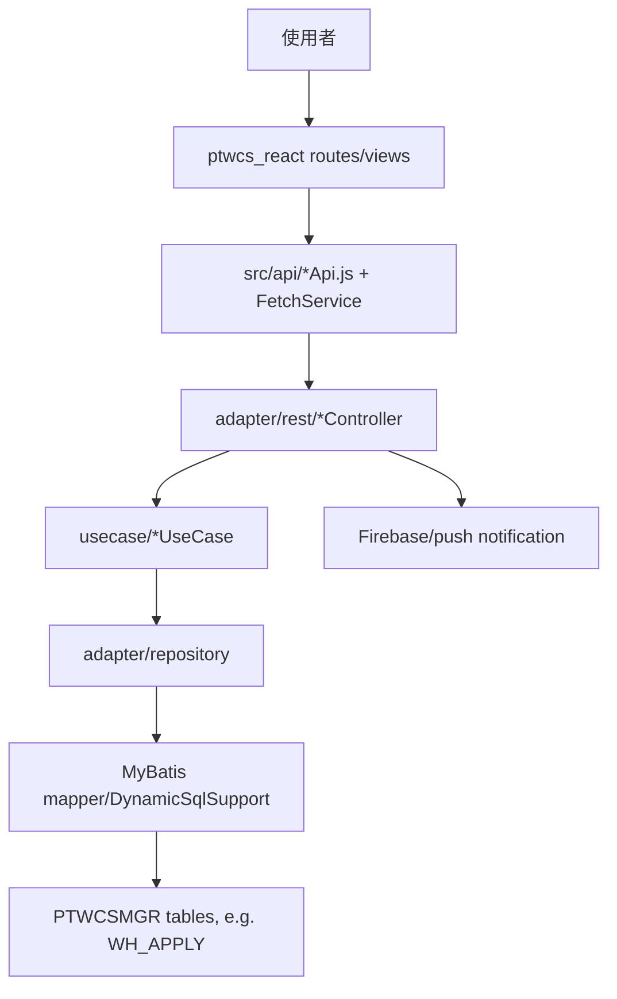

# PTWCS 模組功用、資料流與牽涉程式

## 專案定位

PTWCS 是台北關門禁/倉儲進出相關系統，包含 Spring Boot Java 後端與 React 前端。後端呈現 adapter/rest -> usecase -> repository -> MyBatis entity/mapper 的六邊形分層，前端位於 view/ptwcs_react。

CodeGraph 本輪確認：1,074 indexed files, 15,310 nodes；Java 681、JavaScript 361、JSX 5。

## 模組功用與牽涉程式

| 模組 | 功用 | 牽涉程式/路徑 |
|---|---|---|
| Spring Boot app/config | 後端啟動與環境設定 | ptwcs_ap/pom.xml；application.properties；application-local/test/ver/prod.properties |
| REST adapter | API 入口與外部通訊 | adapter/rest/AuthController.java；WHApplyController.java；InOutWarehouseController.java；ReportController.java；NotifyController.java；AuditController.java；UploadFileController.java |
| Use case | 業務動作封裝 | usecase/whapply；usecase/whrec；usecase/inoutwarehouse；Fetch/Create/Reply/Approval 類 UseCase |
| Repository | DB/外部資料存取實作 | adapter/repository/*RepositoryImpl.java；adapter/rest/auth/*Repository.java |
| MyBatis entity/mapper | PTWCSMGR tables 動態 SQL 與 PO | adapter/entity/mapper/*DynamicSqlSupport.java；WhApplyMapper.java；adapter/entity/po/WhApply.java |
| React routes/views | 前端路由與頁面 | view/ptwcs_react/src/routes；view/whapply/WHApply.js；view/InOutWarehouse/*；view/setting/*；view/audit/* |
| React API/common | 前端 API client 與共用 fetch/message/component | src/api/*Api.js；common/FetchService.js；common/MessageHelper.js；components/* |
| Firebase/push | Firebase web push/service worker 類檔案 | firebase-messaging-sw.js；firebase-app-compat.js；firebase-messaging-compat.js |
| 工具/報告 | exclusion report 與文件/scripts | generate_exclusion_report.js；docs；scripts |

## 主要資料流

## 已驗證例子

| 功能 | 程式 | 觀察 |
|---|---|---|
| WH_APPLY | WhApplyDynamicSqlSupport；WhApplyMapper；WhApply.java | DynamicSqlSupport 對應 PTWCSMGR.WH_APPLY |
| 外部進出倉建立 | CreateExternalInoutwarehouseUseCaseImpl.create() | checkService -> repository.checkDocInfo -> ApprTypeUtils -> 建立 WhApply |
| 內部准駁更新 | InternalInoutwarehouseRepositoryImpl.convert2WhApply() | 將 Approval input 與舊資料轉成 WhApply PO |

## 盤點限制與下一步

本文件不摘錄 application properties 或 Firebase/credential 內容，只標示配置與風險類型。
下一步應建立「React view/API -> Controller -> UseCase -> Repository -> Mapper/Table」矩陣，優先追 WHApply、InOutWarehouse、Auth、Audit、Notify。
