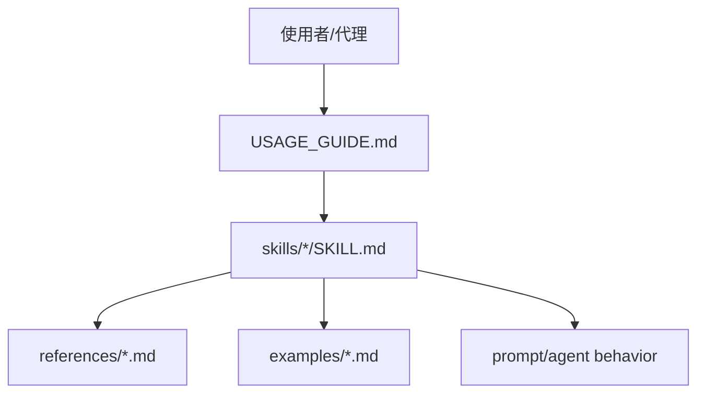

# claude-parity-skills-package 模組功用、資料流與牽涉檔案

## 專案定位

claude-parity-skills-package 是 Markdown skill package，不是 runtime codebase。CodeGraph indexed files 為 0，符合純文件/技能包特性。

CodeGraph 本輪確認：0 indexed files, 0 nodes。

## 模組功用與牽涉檔案

| 模組 | 功用 | 牽涉檔案 |
|---|---|---|
| 使用指南/差異分析 | 說明安裝、使用與 Claude parity 差異 | USAGE_GUIDE.md；differential_analysis.md |
| 協調/任務 | 協調技能與任務流程 | skills/skill-coordinator/SKILL.md；task-orchestrator/SKILL.md |
| 思考/判斷 | 推理、直覺判斷、類比推理、後設認知 | thinking-engine；intuitive-judgment；analogical-reasoning；metacognition-core |
| 安全/規則 | 安全守門與 Claude 規則 | safety-guardian；claude-rules |
| Context/codebase | 上下文建構與 codebase adapter | context-architect；codebase-adapter |
| Coding/output | coding mastery、輸出工藝 | coding-mastery；output-craftsman |
| Persona/collab | Claude soul、collaborative engine | claude-soul；collaborative-engine |
| Examples/references | 範例與參考資料 | skills/*/examples；skills/*/references |

## 主要資料流

## 盤點限制與下一步

此專案不適合追程式呼叫流。下一步應檢查每個 SKILL.md 的觸發條件、輸入、輸出、衝突規則與是否可安裝到 Codex/Claude 技能目錄。
