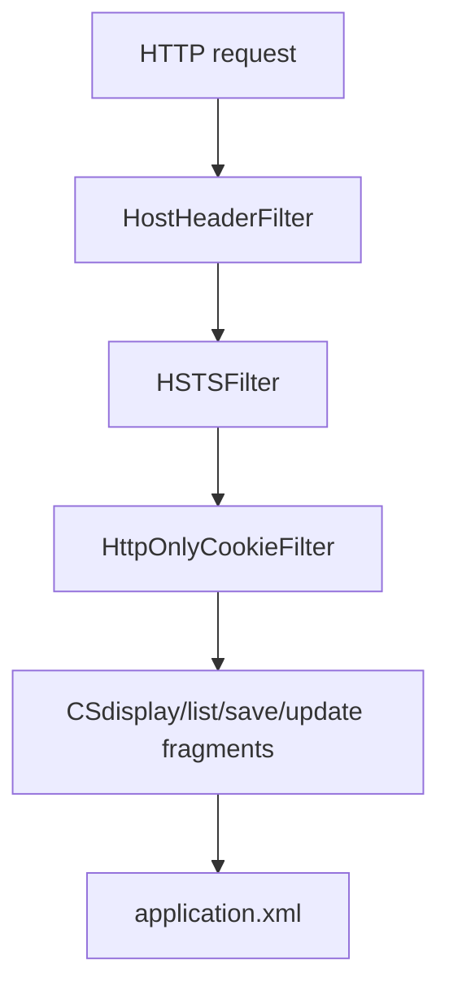

# pclms_ap_tmp 模組功用、資料流與牽涉程式

## 專案定位

pclms_ap_tmp 是 PCLMS_AP 相關暫存/片段目錄，不是完整 AP 專案。它包含 CSdisplay/list/save/update 片段、csdisplay.js、application.xml，以及 HostHeader/HSTS/HttpOnlyCookie 等安全 filter。

CodeGraph 本輪確認：8 indexed files, 175 nodes；Java 7、JavaScript 1。

## 模組功用與牽涉程式

| 模組 | 功用 | 牽涉程式/路徑 |
|---|---|---|
| CS 作業片段 | 可能是 PCLMS AP 的 CS 顯示/查詢/儲存/更新功能片段 | CSdisplay.java；CSlist.java；CSsave.java；CSupdate.java；csdisplay.js |
| Host header filter | 限制 allowedHost，阻擋不在清單內的 Host header | HostHeaderFilter.java |
| HSTS filter | 加 Strict-Transport-Security header | HSTSFilter.java |
| HttpOnly/SameSite cookie filter | 對 response cookie 加 HttpOnly/Secure/SameSite，支援 excludeCookies | HttpOnlyCookieFilter.java |
| Config/manifest | 片段配置與 webapp manifest | application.xml；src/main/webapp/META-INF/MANIFEST.MF |

## 主要資料流

## 已驗證例子

| 功能 | 程式 | 觀察 |
|---|---|---|
| Host header | HostHeaderFilter.doFilter() | 讀 allowedHost init-param，host 不符回 403 |
| Cookie header | HttpOnlyCookieFilter | 支援 SameSite Strict/Lax/None 與 excludeCookies |
| HSTS | HSTSFilter.doFilter() | response.addHeader Strict-Transport-Security |

## 盤點限制與下一步

此目錄應視為 patch/暫存/比對素材，不能替代 PCLMS_AP 完整盤點。下一步應比對這些檔案是否已合入 PCLMS_AP 正式 repo，並註記差異。
