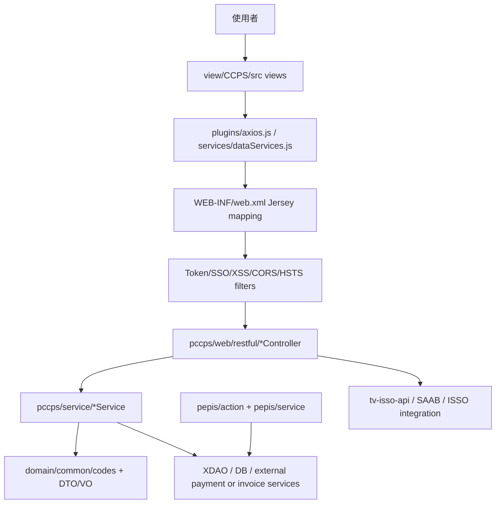

# pepis_ap 模組功用、資料流與牽涉程式

## 專案定位

pepis_ap 是 PEPIS/CCPS 類混合專案，包含 Vue 2 + Vuetify 前端、Jersey REST controller、SSO/filter、PEPIS legacy action/service 與交易/帳單/授權/繳費業務服務。

CodeGraph 本輪確認：1,406 indexed files, 34,416 nodes；Java 1,186、JavaScript 176、Vue 41。

## 模組功用與牽涉程式

| 模組 | 功用 | 牽涉程式/路徑 |
|---|---|---|
| Vue 入口與路由 | 前端 App、router、store、config、axios plugin | view/CCPS/src/App.vue；main.js；router/index.js；store/index.js；plugins/axios.js；services/dataServices.js |
| Vue 業務頁 | 帳單、繳費、授權、銷帳、發票、付款服務申請等畫面 | BillCreate.vue；BillQuery.vue；Pay.vue；AuthorizationQuery.vue；AuthApply*.vue；WriteOff.vue；Invoice.vue；TransPayment.vue；edda/* |
| Jersey REST controller | 前端呼叫的 REST API 入口 | pccps/web/restful/SecurityController.java；BillCreateController.java；BillQueryController.java；PayController.java；InvoiceController.java；AuthorizationController.java；WriteOffController.java；TransPaymentController.java；PaymentServiceApplyController.java；CommonController.java |
| REST path/API 白名單 | 定義 REST path 與可公開/控管 API | RestResourcePath.java；CcpsApiCodes.java |
| Login/SSO/filter | 登入、token、SSO 橋接、安全/跨域/字元編碼 | SecurityController.java；TokenFilter.java；MySSOLoginFilter.java；FixSSOLoginFilter.java；MockLoginFilter.java；XssFilter.java；CorsFilter.java；HstsFilter.java；CharacterEncodingFilter.java |
| CCPS service | REST controller 後端服務層 | BillCreateService.java；BillQueryService.java；PayService.java；AuthorizationService.java；WriteOffService.java；InvoiceService.java；TransPaymentService.java；PccpsTokenService.java；MailService.java |
| PEPIS legacy service | bi/mf/ii/sb/common 等 PEPIS 資料寫入、讀取、製造/收發/包裝服務 | pepis/service/bi；mf；ii；sb；common；ReadDataService.java；WriteDataService.java；AuthService.java；CloudService.java |
| Module/SAAB 權限 | 系統代碼、角色代碼、module 對照與 SAAB 權限相關 | com/tradevan/pepis/ModuleInfo.java；pepis/action/LoginAction.java；MenuAction.java；UserAccountAction.java |

## 主要資料流

## 已驗證例子

| 功能 | 前端/入口 | 後端 |
|---|---|---|
| 登入 | Login/axios 呼叫 REST auth | SecurityController @Path(RestResourcePath.AUTH)，RestResourcePath.AUTH_PATH.LOGIN，CcpsApiCodes.AUTH_LOGIN |
| 帳單 | BillCreate/BillQuery/BillDownload views | BillCreateController、BillQueryController、BillCreateService、BillQueryService |
| 授權 | AuthorizationQuery/AuthApply views | AuthorizationController、AuthorizationService |
| 繳費 | Pay.vue / TransPayment.vue | PayController、TransPaymentController、PayService、TransPaymentService |
| 銷帳 | WriteOff.vue / WriteOffQuery.vue | WriteOffController、WriteOffService、WriteOffFileService |
| 發票 | Invoice.vue | InvoiceController、InvoiceService |

## 盤點限制與下一步

本文件先盤點到 controller/service/API path 層。
下一步應對每個 RestResourcePath 常數建立「Vue view -> REST path -> controller method -> service method -> DAO/XDAO/外部系統」矩陣，並把公告線路與 tv-isso-api 的 getAPPAnnouncement/getLoginAnnouncement 分開標示。
