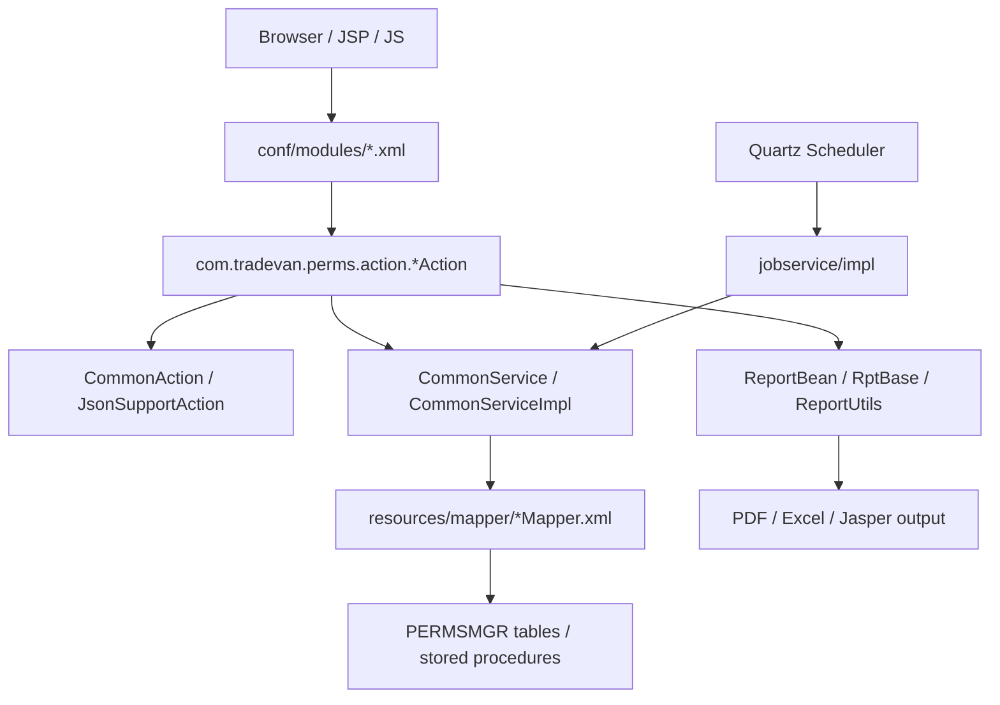

# perms 模組功用、資料流與牽涉程式

## 專案定位

perms 是 Struts/Java Web + MyBatis mapper + 報表/批次型系統。它的核心追法是：頁面 JSP/JS -> Struts module XML -> Action -> CommonService -> MyBatis mapper -> DB/procedure/report。

CodeGraph 本輪確認：701 indexed files, 27,238 nodes；Java 291、JavaScript 268、TypeScript 123。

## 模組功用與牽涉程式

| 模組 | 功用 | 牽涉程式/路徑 |
|---|---|---|
| Struts module config | 定義作業代碼、Action class、JSP result | src/main/resources/conf/modules/am.xml；mg.xml；rt.xml；其他 modules XML |
| AM 作業 | 申請/審核/報表類作業；AM001 已確認由 am.xml 對到 AM001Action 與 AM001.jsp | com/tradevan/perms/action/am/AM001Action.java；pages/am/AM001.jsp；AM002-006Action |
| MG 作業 | 管理/維護類作業；MG014 已確認由 mg.xml 對到 MG014Action 與 MG014.jsp | com/tradevan/perms/action/mg/MG014Action.java；pages/mg/MG014.jsp |
| RT 作業 | 報表/統計類作業；RTSG001 已確認由 rt.xml 對到 RTSG001Action 與 RTSG001.jsp | com/tradevan/perms/action/rt/RTSG001Action.java；pages/rt/RTSG001.jsp |
| MyBatis persistence | 把 mapperName/statementName 組成 namespace 呼叫 mapper | com/tradevan/perms/persistence/CommonService.java；CommonServiceImpl.java；resources/mapper/*.xml |
| 申請/公司/權限 mapper | 處理 Apply、Company、Xauth、Client、Bulletin、Audit 等資料 | ApplyMainMapper.xml；ApplyDtlMapper.xml；Company*Mapper.xml；Xauth*Mapper.xml；Client*Mapper.xml |
| 報表 mapper/procedure | 報表設定、報表清單、procedure 執行與日統計 | ErmsRptMapper.xml；ErmsProcMapper.xml；RptMapper.xml；RptConfigMapper.xml；DayStatConfigMapper.xml |
| 報表輸出框架 | 組 ReportBean、RptBase、ReportUtils/Jasper/PDF/Excel 類輸出 | generic/rpt/RptBase.java；generic/rpt/model/ReportBean.java；action/common/CommonJasperAction.java；rpt/template/RptTmp_SG01.java |
| 排程/批次 | Quartz scheduler 與 jobservice 執行統計或批次 procedure | resources/conf/applicationContext/applicationContext-tx.xml；jobservice/impl/DoDayStatJobServiceimpl.java |
| 前端共用資產 | JSP 使用的 jQuery、jqGrid、datepick、jstree、commons JS | src/main/webapp/js；src/main/webapp/pages |

## 主要資料流

## 已驗證例子

| 作業 | 路由/設定 | Action | 資料/輸出 |
|---|---|---|---|
| AM001 | conf/modules/am.xml -> /pages/am/AM001.jsp | AM001Action.java | ReportBean、RptBase、ReportUtils |
| RTSG001 | conf/modules/rt.xml -> /pages/rt/RTSG001.jsp | RTSG001Action.java | ErmsRptMapper.spcRptSg01 |
| MG014 | conf/modules/mg.xml -> /pages/mg/MG014.jsp | MG014Action.java | 下一輪需追 mapper statement |
| 日統計批次 | applicationContext-tx.xml Quartz | DoDayStatJobServiceimpl.java | CommonService.getOne("ErmsProcMapper", spcName, params) |

## 盤點限制與下一步

node_modules 是工具/依賴目錄，不列入核心模組。
下一步應對 am/mg/rt/bu/dl/hq 每個 module XML 產生「作業代碼 -> Action -> JSP -> mapper statement/procedure」矩陣。
