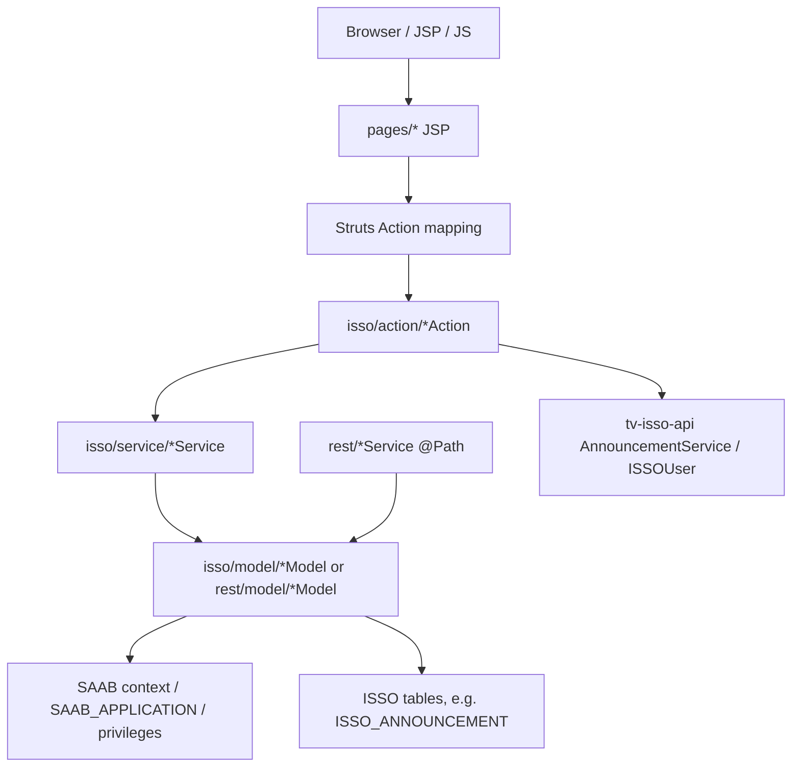

# pisso_ap 模組功用、資料流與牽涉程式

## 專案定位

pisso_ap 是 ISSO/SAAB 管理與登入入口系統，採 Struts/JSP + Java Action/Service/Model + REST service。它負責登入頁、使用者/組織維護、應用系統選單、公告維護、push/msg/app REST 服務等。

CodeGraph 本輪確認：767 indexed files, 4,445 nodes；Java 102、JavaScript 643、PHP 22。

## 模組功用與牽涉程式

| 模組 | 功用 | 牽涉程式/路徑 |
|---|---|---|
| 登入/SSO/SAML | 多系統登入頁、一般登入、NLogin、SAML、FDX SAML | pages/user/*_login.jsp；LoginAction.java；NLoginAction.java；SamlLoginAction.java；action/saml/FDXSamlLoginAction.java |
| App/選單/登入後首頁 | 取得 user privileges/menus/roles/orgs/apps，處理登入後公告 | AppAction.java；pages/main.jsp；pages/issoMain.jsp；pages/menu.jsp |
| 公告維護與查詢 | 維護/查詢 ISSO 公告，取得使用者可見 app list | AnnouncementAction.java；AnnouncementService.java；AnnouncementModel.java；pages/announcement/* |
| 使用者維護 | 客戶使用者查詢、新增、角色/權限/ISSO/EDW/箱號維護 | ClientUserAction.java；ClientUserService.java；pages/userMtn/* |
| 組織維護 | 組織查詢、修改、新增、箱號資料 | OrgMtnAction.java；pages/orgMtn/*；IssoBoxDataModel |
| Public/Profile | 公開資訊、使用者 profile、密碼重設/修改 | PublicInfoAction.java；PublicInfoService.java；UserProfileAction.java；pages/user/userProfile.jsp；resetPassword.jsp；chgPassword.jsp |
| REST service | 行動/外部 app 服務清單、login、msg、push | rest/appService.java；loginService.java；msgService.java；pushService.java；rest/model/AppSysModel.java；IssoAnnouncementModel.java |
| TVVA 憑證 | TVVA 使用者憑證查詢/維護 | com/tradevan/tvva/action/tvvaAction.java；tvva/model/*；pages/tvva/tvvaQuery.jsp |
| 前端共用 JS/JSP layout | Struts/jQuery/Kendo/jstree/validate/menu 等前端資產 | src/main/webapp/js；common/*.jsp；pages/layout.jsp；header.jsp；footer.jsp |

## 主要資料流

## 已驗證例子

| 功能 | 程式 | 資料流重點 |
|---|---|---|
| 登入公告 | LoginAction.getLoginAnnouncement() | 呼叫 AnnouncementService.getLoginAnnouncement(request orgId)，走 T/top 類登入公告線路 |
| 登入後公告 | AppAction.getAnnouncement() | 呼叫 getAPPAnnouncement(defaultApplication, ISSOUser.createUser(currentUser)) |
| 公告 app 下拉 | AnnouncementAction.getUserAppList() | 手動加入 TDIS，並查使用者可見 SAAB application |
| App REST 清單 | rest/appService.java @Path("/getAppList") | 走 APP_SYS 類 REST model，不等同公告維護的 SAAB application 下拉 |

## 盤點限制與下一步

本文件完成 PISSO 第一層模組與公告/登入資料流。
下一步應補 struts.xml/action mapping 的完整對照，並將 pages/announcement、pages/userMtn、pages/orgMtn 對到各 action method 與 model SQL。
