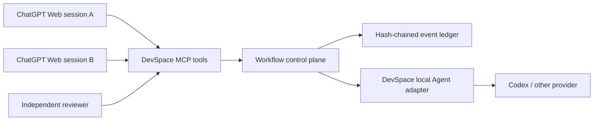
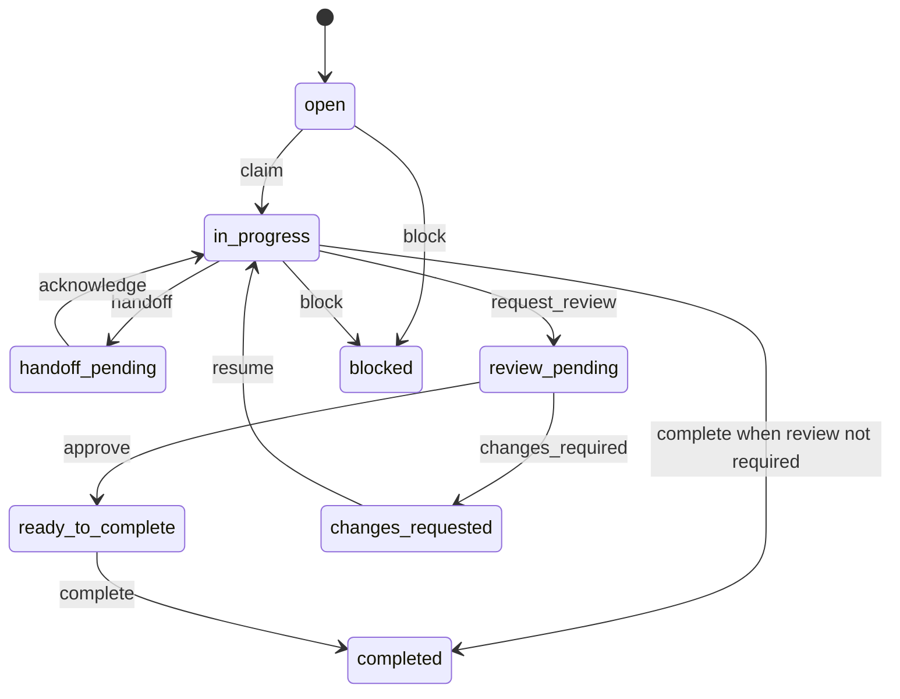

> **English summary:** DevSpace gains an auditable cross-session work control plane for ChatGPT Web and local agents, with scoped handoffs, independent review, and explicit execution-policy resolution.

# DevSpace 跨 Session 工作控制層

## 概觀

這個功能讓 ChatGPT Web 透過 DevSpace 建立、查詢、接手與監督工作。工作狀態不依賴單一對話的記憶，而是寫入本機 append-only ledger；同一專案、不同專案或限定單一 session 都使用同一份明確狀態機。

DevSpace 本地 Agent 可以依每次工作指定模型與推理強度。Deep Research 與 Pro mode 也能寫入執行政策，但執行器若不支援，必須依使用者選擇「阻擋」或「明確降級」，並同時記錄 requested/effective policy。

## 核心資料

- Task：範圍、目標、驗收條件、目前負責人、狀態、revision。
- Handoff：來源、目標、上下文快照、交付物、未完成項、下一動作與 acknowledgment。
- Review：固定受審 revision、producer、reviewer、判定與 findings。
- Run：角色、Agent session、requested/effective policy、輸出與終止狀態。
- Event：idempotency key、前後 revision、完整 task snapshot、previous hash 與 event hash。

## 範圍隔離

| 模式 | 規則 |
|---|---|
| `single_session` | 只有相同 `sessionRef` 可讀寫工作。 |
| `same_project` | 任何 session 可接手，但目前 workspace root 必須等於建立工作的 project root。 |
| `cross_project` | 建立時明列至少兩個已開啟的 workspace roots；後續只能從 allowlist 內操作。 |

## 狀態機

所有 mutation 都要求 `expectedRevision`，並在檔案鎖內以 compare-and-swap 執行。同一個 `idempotencyKey` 重試時回傳原結果，不重複建立事件。

## Web 工具

- `workflow_create`：建立工作並選擇 scope、模型、reasoning effort、Deep Research、Pro mode 與 unsupported behavior。
- `workflow_list`：列出目前 workspace/session 可見工作，或取得單一 task。
- `workflow_update`：claim、handoff、acknowledge、request_review、submit_review、resume、complete、block。
- `workflow_run`：以 worker 或 reviewer 身分啟動 DevSpace Agent；模型與推理強度由 task policy 帶入。
- `workflow_sync`：同步 Agent session 狀態與輸出到 ledger。

## 安全與失敗策略

- ledger 不保存 OAuth token、API key 或對話憑證。
- project root 由 DevSpace 已驗證的 workspace registry 提供，不接受任意路徑。
- reviewer 必須不同於 producer，且 review 綁定固定 revision。
- lock 過期才可回收；未知 ledger hash drift 直接拒絕讀寫。
- 本地 Agent adapter 不宣稱支援 Deep Research 或 Pro；`block` 會拒絕執行，`explicit_degrade` 會記錄警告與 effective=false。
- Web GPT 任意聊天的自動啟動沒有公開通用介面；跨 session 接力採下一個 session 主動 list/claim/acknowledge。

## 不做的事

- 不把 ChatGPT Project memory 當 source of truth。
- 不自動控制任意既有 ChatGPT 聊天或替使用者切換 Web UI 模型。
- 不在這一版新增雲端資料庫、背景排程器或第三方服務。
- 不修改現有 watchdog/reconnect 行為。
