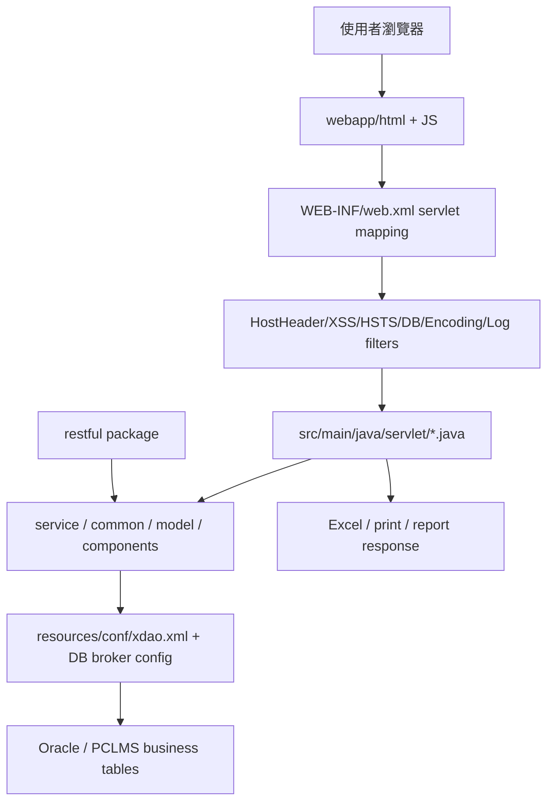

# PCLMS_AP 模組功用、資料流與牽涉程式

## 專案定位

PCLMS_AP 是 PCLMS 的 legacy Java Web/AP 層。它同時包含傳統 HTML/JS、web.xml servlet mapping、filter/listener、service/common/model/component 等後端程式。
它是使用者進入保稅/帳務/月結/報表等作業的主要入口之一。

CodeGraph 本輪確認：756 indexed files, 17,332 nodes；主要語言為 Java 642 檔與 JavaScript 98 檔。

## 模組功用與牽涉程式

| 模組 | 功用 | 牽涉程式/路徑 |
|---|---|---|
| Web 啟動與過濾器 | 啟動 Spring/context、套用安全/編碼/DB connection/XSS/HSTS/log filter | JAVA/pclms_mvn/src/main/webapp/WEB-INF/web.xml；restful.exceptionmapper.HostHeaderFilter；restful.exceptionmapper.XSSFilter；DbConnectionFilter；EncodingFilter；ContextRootFilter；LogFilter |
| Legacy servlet 作業入口 | web.xml 將功能 URL 對應到 servlet.* 類別，是舊式作業流程的核心入口 | src/main/java/servlet/AddBOM.java；AddBOMDetail.java；AddBOMSave.java；AddDecl*.java；AddIn*.java；AddOut*.java；AddScrap*.java；BOM*.java；CalB.java；CancelMonth.java；CatInMonth.java；CatOutMonth.java |
| BOM/料件/成品結構 | 處理 BOM 新增、明細、儲存與頁面互動 | src/main/java/servlet/AddBOM*.java；src/main/webapp/html/js/workitem/AddBOM.js；AddBOMDetail.js |
| 進出倉與月結 | 處理進倉、出倉、月資料、carry/vehicle/check/detail/save 類流程 | src/main/java/servlet/AddIn*.java；AddOut*.java；chkInDetail*.java；chkOutDetail*.java；CatInMonth.java；CatOutMonth.java；CatMonthSave.java |
| 報單/申報 | 處理報單 header/detail/display/save 與相關檢核 | src/main/java/servlet/AddDecl*.java；Check*.java；相關 html/js |
| 報表與列印 | 產生或下載帳務、貨品、放行單等報表輸出 | servlet.GoodsMonthExcel；servlet.RlsBillPrint；servlet.a_balance_taxamt；servlet.a_DD330 |
| REST/例外/安全端點 | 承接新式 restful package、例外 mapper、host header/XSS 等橫切處理 | src/main/java/restful；restful.exceptionmapper.* |
| Service/common/model/component | 提供 servlet 與 REST 共用服務、資料模型、元件與工具 | src/main/java/service；common；model；components；clms；com |
| DAO/DB 設定 | 透過 xdao 與 JXGB DB connection broker 連到資料庫 | src/main/resources/conf/xdao.xml；application_context_base.xml；application.xml；com/javaexchange/dbConnectionBroker/JXGBconfig.properties |

## 主要資料流

## 例子：BOM 作業流

CodeGraph 搜尋 AddBOM 可同時看到：

| 層 | 程式 |
|---|---|
| 前端 JS | JAVA/pclms_mvn/src/main/webapp/html/js/workitem/AddBOM.js |
| servlet 入口 | JAVA/pclms_mvn/src/main/java/servlet/AddBOM.java |
| 明細 servlet | JAVA/pclms_mvn/src/main/java/servlet/AddBOMDetail.java |
| 儲存 servlet | JAVA/pclms_mvn/src/main/java/servlet/AddBOMSave.java |

因此此類 legacy 功能的追法是：頁面 JS 事件或 form action -> web.xml mapping -> servlet doPost/doGet -> service/common/model 或直接 DAO 邏輯 -> xdao/DB。

## 盤點限制與下一步

本文件已完成第一層模組功能與資料流歸納，但尚未逐一展開 427 個 servlet 檔案。
下一步建議依業務主題拆成：BOM、報單、進倉、出倉、月結、報表、權限/登入、安全 filter，逐項追 web.xml mapping、前端 JS、servlet、service/DAO/SQL。
