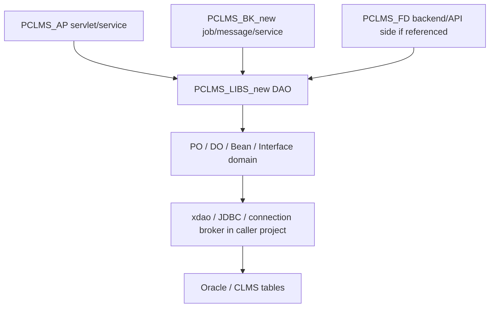

# PCLMS_LIBS_new 模組功用、資料流與牽涉程式

## 專案定位

PCLMS_LIBS_new 是 PCLMS 家族的共用 Java library，主要承載 DAO、PO/domain、interface、共同資料模型與部分 datamining 支援。
它不是使用者入口，也不是排程入口，而是 AP/BK/API 類專案會引用的資料存取與領域模型層。

CodeGraph 本輪確認：289 indexed files, 8,886 nodes；全部為 Java。

## 模組功用與牽涉程式

| 模組 | 功用 | 牽涉程式/路徑 |
|---|---|---|
| DAO 層 | 封裝資料表存取、查詢、更新與業務資料操作 | com/tradevan/clms/common/dao/*DAO.java |
| PO/domain 層 | 表示資料表或業務物件，讓 AP/BK/API 共用同一組欄位模型 | com/tradevan/clms/common/domain/*Po.java；*Do.java；*Bean.java |
| Interface domain | 定義共用介面與多型資料模型 | common/domain/I*Po.java；例如 IDecl*、IGrnt*、IClmsL6*、IBom* |
| 工單/料件/BOM | 支援 workorder、workitem、BOM、product 等製造/料件資料 | WorkorderDAO/Po；WorkitemDAO/Po；ProductDAO/Po；IBom* |
| 倉儲/車輛/進出資料 | 支援倉庫、車輛、進倉、出倉、月資料、log | WarehseDAO/Po；VehicleDAO/Po；IndetailDAO/Po；OutdetailDAO/Po；MonthDAO/Po；IndetailLogDAO；OutdetailLogDAO |
| 報單/放行/保證金 | 支援 declar、release、rlsbill、grnt 類資料 | IDecl*；ReleaseDAO/Po；RlsbillDAO/Po；IGrnt* |
| 收送/訊息/批次狀態 | 支援 sendlog、recvlog、mailque、jobque、IOG | SendlogDAO/Po；RecvlogDAO/Po；Mailque*；Jobque*；IOGDAO |
| 系統/稽核/代碼 | 支援使用者、活動、代碼、異動紀錄 | UserinfDAO/Po；UserActionDAO/Po；SyscodeDAO/Do；ModlogDAO/Po |
| Datamining | 可能提供分析或資料探勘支援，需下一輪逐類別確認 | com/tradevan/clms/datamining |

## 主要資料流

## DAO/Domain 對照重點

| 業務區 | DAO/Domain 例子 | 意義 |
|---|---|---|
| 工單與料件 | WorkorderDAO/Po；WorkitemDAO/Po；ProductDAO/Po | 生產或加工資料主體 |
| 倉儲 | WarehseDAO/Po；VehicleDAO/Po；IndetailDAO/Po；OutdetailDAO/Po | 倉庫、車輛、進出明細 |
| 月結/帳務 | MonthDAO/Po；MonthItemBean；PartialstoreDAO/Po | 月資料、庫存、帳務基礎 |
| 訊息/紀錄 | SendlogDAO/Po；RecvlogDAO/Po；ModlogDAO/Po | 收送紀錄與異動紀錄 |
| 批次/佇列 | Jobque*；Mailque*；IOGDAO | 背景工作與交換流程狀態 |
| 報單/放行/保證金 | IDecl*；ReleaseDAO/Po；RlsbillDAO/Po；IGrnt* | 報關、放行、保證金相關資料 |

## 盤點限制與下一步

本文件完成共用 library 的資料模型邊界盤點。
下一步應用 CodeGraph impact/callers 反查 AP/BK 對各 DAO 的呼叫者，建立「DAO -> 使用者模組 -> 實際流程」矩陣，避免只知道表名而不知道業務入口。
