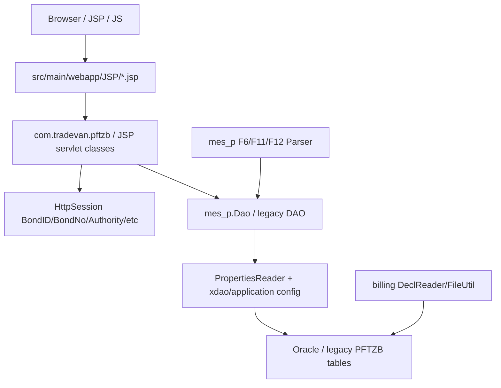

# PFTZB 模組功用、資料流與牽涉程式

## 專案定位

PFTZB 不是空專案；目前 repo 顯示它是大型 legacy Java/JSP/Web 專案，主體位於 PFTZB/PFTZB_AP-master。舊 vault 登錄曾標成 0 Java/廢棄，本輪 CodeGraph 現況已修正。

CodeGraph 本輪確認：1,152 indexed files, 24,452 nodes；Java 984、JavaScript 158。

## 模組功用與牽涉程式

| 模組 | 功用 | 牽涉程式/路徑 |
|---|---|---|
| Web/JSP 入口 | 傳統 JSP 畫面、登入、menu、報表/作業頁 | src/main/webapp/index.jsp；JSP/*.jsp；JSP/commonPages/menuBar.jsp；MON/WebMon-PFTZB.jsp |
| Servlet 作業 | legacy HttpServlet 作業入口，直接讀 session 與 request | com/tradevan/pftzb/AddBOM.java；JSP/UploadPrdtSave.java；RlsDeclareConfirmItems.java |
| JSP JavaScript | 表單檢核、BOM、進出倉、盤點、保證金、放行確認等前端腳本 | JSP/js/AddBOMDetail.js；AddInGgoods.js；AddInvtryCard.js；guaranty.js；RlsWorkitem.js；Z_*.js |
| mes_p parser/dao | F11/F12/F6 等訊息 parser/DAO，讀 properties 後取 JDBC connection | mes_p/Dao.java；Parser.java；PropertiesReader.java；F6/F6Dao.java；F11/F11Dao.java；F12/F12Dao.java |
| clms/html 工具 | 舊 CLMS 共用工具與資料處理類 | clms/html/CheckAuth.java；MenuCode.java；ErrorCode.java；calQty.java；calGuaranty.java；clearStore.java |
| billing | 報單/帳務檔案讀取與 file utility | billing/DeclReader.java；FileUtil.java；FileUtilFilter.java；PropertiesReader.java |
| beans | 報單、月份、測試項目、計算用 bean | clms/beans/DeclDetailBean.java；MonthItemBean.java；TestItemBean.java；DoubleCalBean.java |
| DB/config | xdao、application、logging 與環境設定 | src/main/resources/conf/xdao.xml；application.xml；logging.xml；env/*/conf/xdao.xml |

## 主要資料流

## 已驗證例子

| 功能 | 程式 | 觀察 |
|---|---|---|
| BOM 新增 | com/tradevan/pftzb/AddBOM.java | HttpServlet 讀 session 中 BondID/BondNo/BondName/Authority/Right 等值 |
| F11/F12/F6 訊息 | mes_p/F11/F11Dao.java；F12Dao.java；F6Dao.java | 依 mes_p.Dao 共用連線與更新邏輯 |
| DB connection | mes_p/Dao.java | PropertiesReader 讀 DB SID/user/password 後用 JDBC datasource 取得 connection |

## 盤點限制與下一步

target/classes 與 target/tomcat 是 build output，不列核心模組。
下一步應分出「JSP 頁面 -> servlet/class -> DAO/parser -> table」矩陣，並判斷此舊系統與 PFTZC 新系統是否功能重疊或是歷史版本。
