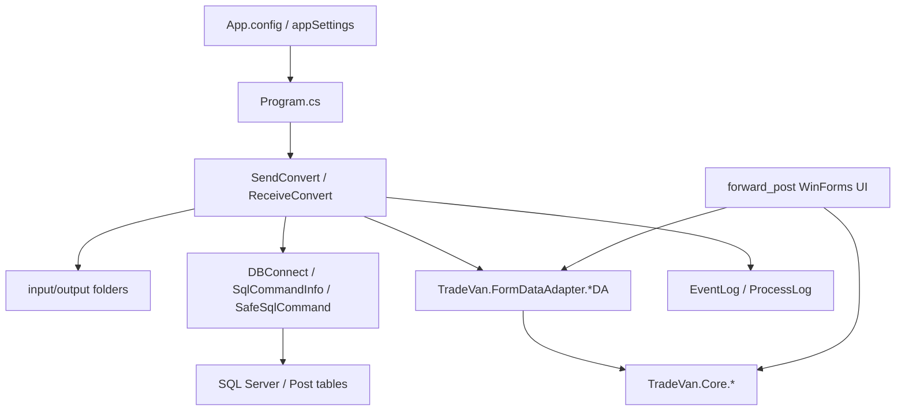

# PPOST 模組功用、資料流與牽涉程式

## 專案定位

PPOST 是大型 C# 專案群，包含多個 solution、轉檔/接收/寄送 console app、WinForms forward_post、資料存取 adapter、Core library 與壓縮備份檔/修補計畫文件。核心不是 Java，而是 C# 檔案轉換、郵政/EC/空運資料交換與資料庫存取。

CodeGraph 本輪確認：550 indexed files, 11,375 nodes；C# 545。

## 模組功用與牽涉程式

| 模組 | 功用 | 牽涉程式/路徑 |
|---|---|---|
| post 主 solution | EHU/POST 主專案群，含 Core、FormDataAdapter、Document、DataBase | post/EHU.sln；post/EHU.Library；TradeVan.Core.*；TradeVan.FormDataAdapter.* |
| postal_convert | 郵政轉檔/收送轉換 | postal_convert/PostalConvert.sln；PostalConvert/Program.cs；SendConvert.cs；ReceiveConvert.cs；DBConnect.cs |
| postal_convert_5204 | 5204 版本郵政轉檔，含 SafeSql/InputValidator 修補 | postal_convert_5204/PostalConvert/PostalConvert.csproj；SafeSqlCommand.cs；InputValidator.cs；HWBCheck.cs |
| ec_convert | EC 轉檔與收送 | ec_convert/ECConvert.sln；Program.cs；SendConvert.cs；ReceiveConvert.cs；PackageA/B/C.cs；NecessaryABC.cs |
| ec_receive | EC 回傳接收處理 | ec_receive/ECReceive.sln；Program.cs；ReceiveConvert.cs |
| enplane_convert | 空運/裝機轉檔 | enplane_convert/EnplaneConvert.sln；SendConvert.cs；ReceiveConvert.cs；DBConnect.cs |
| forward_post | WinForms forward/picking/order UI 與 updater | forward_post/ForwardPOST.sln；ForwardPOSTUpdate；ForwardPOST/01.主畫面；02.序號管理；04.揀貨作業 |
| Data adapter | DB table adapter / DAO 類 | post/TradeVan.FormDataAdapter.Share/*DA.cs；MnuTrans；MnuQuery |
| Core/library | 商業邏輯與共用 utility | TradeVan.Core.Share；TradeVan.Core.MnuGCIO；TradeVan.Core.MnuTrans；TradeVan.Core.MnuQuery；EHU.Library |
| 安全修補文件/備份 | BSI 修補計畫、Checkmarx 掃描、7z 備份 | BSI_*.md；安全性掃描報告*.md；post (*.7z) |

## 主要資料流

## 已驗證例子

| 功能 | 程式 | 觀察 |
|---|---|---|
| EC 收件轉換 | ec_convert/ECConvert/ReceiveConvert.cs | 建構子讀 REC_Msg、CREC_Msg appSettings，逐訊息 MainProcess |
| EC 送件轉換 | ec_convert/ECConvert/SendConvert.cs | 讀 SND_Msg、WarehouseNo、ProcessTime，檢查資料夾後 fileProcess |
| 日誌 | ec_convert/ECConvert/EventLog.cs | Path.Combine 寫入每日 log，已有路徑遍歷基本檢查與例外捕捉 |
| Postal 5204 | postal_convert_5204/PostalConvert | 包含 SafeSqlCommand/InputValidator/HWBCheck 等風險修補線索 |

## 盤點限制與下一步

*.7z 與修補計畫文件不列為 runtime 模組，但應保留作安全/版本追蹤線索。
下一步應逐 solution 建立「Program -> config key -> Convert class -> DBConnect/DA -> table/file」矩陣，並檢查修補計畫與目前 C# source 是否一致。
