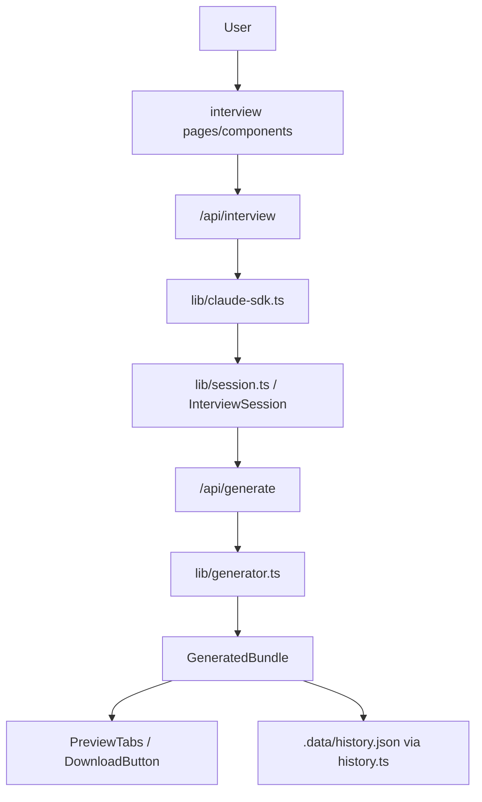

# ProjectCreater 模組功用、資料流與牽涉程式

## 專案定位

ProjectCreater 是 Next.js/TypeScript 專案產生器，透過訪談流程收集需求，呼叫 Claude SDK/生成器產出專案 bundle，並提供 preview、download、history/projects 頁面。

CodeGraph 本輪確認：33 indexed files, 247 nodes；TSX 17、TypeScript 13、JavaScript 2。

## 模組功用與牽涉程式

| 模組 | 功用 | 牽涉程式/路徑 |
|---|---|---|
| Next app pages | 首頁、訪談、專案列表、專案詳情、預覽 | src/app/page.tsx；interview/page.tsx；projects/page.tsx；projects/[name]/page.tsx；preview/[sessionId]/page.tsx |
| API routes | interview、generate、sessions、projects API | src/app/api/interview/route.ts；generate/route.ts；sessions/route.ts；projects/route.ts |
| Claude/interview engine | 訪談狀態、角色問題、助理回覆、推進流程 | src/lib/claude-sdk.ts；interview-flow.ts；session.ts |
| Generator/history | 建立 project spec、產生 bundle、紀錄 history | src/lib/generator.ts；history.ts；paths.ts |
| Preview UI | 檔案預覽、tabs、下載、持久化輸出 | components/preview/PreviewTabs.tsx；DownloadButton.tsx |
| Interview UI | chat window、message、input、new interview | components/interview/* |
| Layout/progress | sidebar、progress、requirements button | components/layout/*；AddRequirementButton.tsx |
| Types | session、bundle、role、message 型別 | src/types/index.ts |

## 主要資料流

## 已驗證例子

| 功能 | 程式 | 觀察 |
|---|---|---|
| 專案列表 | src/app/projects/page.tsx | 讀 listProjects()，顯示 .data/history.json 對應輸出 |
| 訪談狀態 | src/types/index.ts InterviewSession | session 含 projectName/currentRole/currentQuestion/answers/messages/status |
| 預覽持久化 | PreviewTabs.handlePersist() | POST /api/generate，body 帶 sessionId 與 persist=true |

## 盤點限制與下一步

下一步應追 API route 的 request/response schema、Claude SDK 錯誤處理、以及 output path 寫入位置，確認生成檔案邊界。
