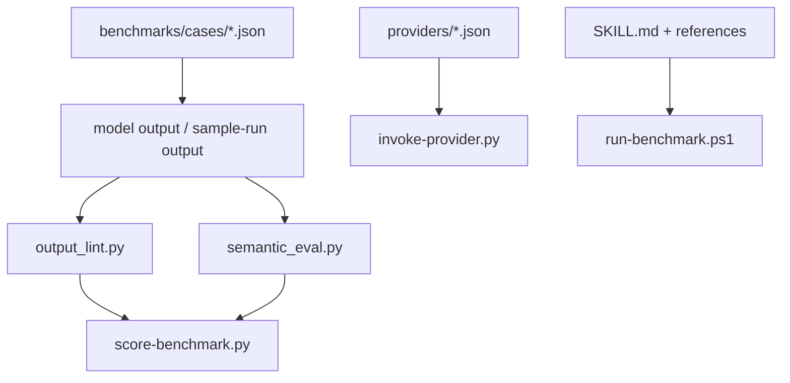

# blankP 模組功用、資料流與牽涉程式

## 專案定位

blankP 是跨模型/技能/benchmark 工具包，不是業務系統。它包含 skill 目錄、provider config、benchmark cases、語意評估、輸出 lint、provider invocation 與 release/check scripts。

CodeGraph 本輪確認：8 indexed files, 56 nodes；Python 5、YAML 3。

## 模組功用與牽涉程式

| 模組 | 功用 | 牽涉程式/路徑 |
|---|---|---|
| Skills | Gemini/GPT parity 與 cross-model rigor 技能 | gemini-gpt-parity/SKILL.md；gpt-other-models-rigor/SKILL.md；references；agents/openai.yaml |
| Providers | OpenAI/Gemini/Anthropic provider 設定 | providers/openai.json；gemini.json；anthropic.json |
| Benchmarks | 測試案例與 sample run | benchmarks/cases/*.json；benchmarks/sample-runs/example-run |
| Output lint | 檢查輸出 heading、順序、內容與 task family 規則 | scripts/output_lint.py；run-output-lint.ps1 |
| Semantic eval | 檢查必要詞、禁止詞、regex、section rule | scripts/semantic_eval.py；run-semantic-eval.ps1 |
| Benchmark score | 結合 lint/semantic/case 規則計分 | scripts/score-benchmark.py；run-benchmark.ps1 |
| Provider invocation | 讀 provider config、送出 request | scripts/invoke-provider.py；run-provider-request.ps1 |
| Validation/release | quick validate、all checks、build provider pack | scripts/quick_validate.py；validate-skill-repo.ps1；build-provider-pack.ps1 |

## 主要資料流

## 已驗證例子

| 功能 | 程式 | 觀察 |
|---|---|---|
| 語意評估 | evaluate_semantics() | 檢查 require_all/require_any/forbid/regex/section rules |
| 輸出 lint | lint_output_text() | 檢查 heading 存在、順序與內容，qna/coding 有特定檢查 |
| Provider config | load_provider_config() | 讀 providers/<provider>.json |

## 盤點限制與下一步

此專案應以工具鏈驗證為主，不追業務 DB 資料流。下一步可補每個 PowerShell script 的輸入/輸出與安全邊界。
