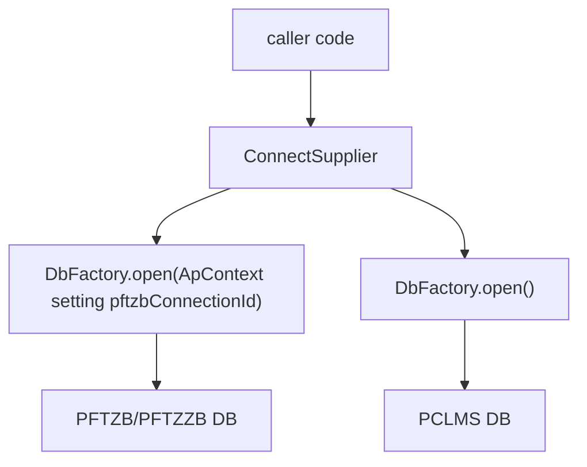

# pclms_bk_tmp 模組功用、資料流與牽涉程式

## 專案定位

pclms_bk_tmp 是非常小的 PCLMS_BK/PFTZB 連線片段目錄，不是完整 BK 專案。它只含 ConnectSupplier.java 與 ver/pclms_bp/conf/xdao.xml。

CodeGraph 本輪確認：1 indexed file, 10 nodes；Java 1。

## 模組功用與牽涉程式

| 模組 | 功用 | 牽涉程式/路徑 |
|---|---|---|
| Connection supplier | 提供 PFTZZB 與 PCLMS 兩種 Connection Supplier | ConnectSupplier.java |
| xdao config | PCLMS BK 片段環境 xdao 設定 | ver/pclms_bp/conf/xdao.xml |

## 主要資料流

## 已驗證例子

| 功能 | 程式 | 觀察 |
|---|---|---|
| PFTZZB connection | ConnectSupplier.PFTZZB | DbFactory.open(ApContext.getContext().getSetting("pftzbConnectionId")) |
| PCLMS connection | ConnectSupplier.PCLMS | DbFactory.open() |

## 盤點限制與下一步

此目錄是連線工具片段，不是完整批次系統。下一步應比對 PCLMS_BK_new 或 PFTZB/PFTZC_BK 是否已有同名/同邏輯 ConnectSupplier，判斷是否為補丁殘留或跨系統連線修正。
