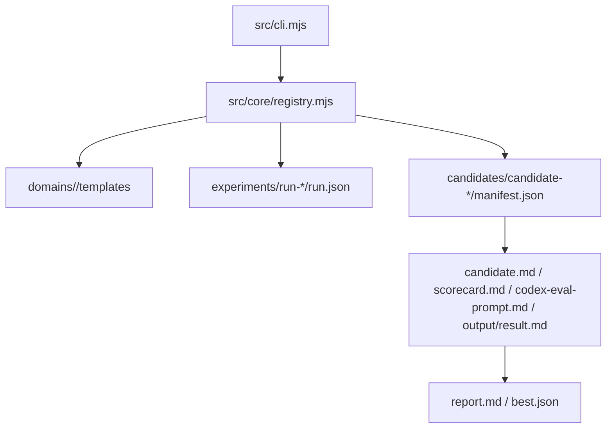

# pixiu-auto-research 模組功用、資料流與牽涉程式

## 專案定位

pixiu-auto-research 是 Node.js/ESM 研究與候選方案評估工具。它以 domain template、run、candidate、scorecard、eval prompt、experiment report 的方式管理實驗。

CodeGraph 本輪確認：9 indexed files, 97 nodes；JavaScript 8。

## 模組功用與牽涉程式

| 模組 | 功用 | 牽涉程式/路徑 |
|---|---|---|
| CLI | 接收 domain/run/candidate/eval 類參數 | src/cli.mjs |
| Registry/core | 建立 run、candidate、讀寫 manifest、列出候選 | src/core/registry.mjs |
| Domain templates | 特定研究領域的候選/評分/prompt 模板 | domains/sast-analysis/templates/*.md；candidate.schema.json |
| Experiments | 每次 run 的結果、候選、scorecard、eval prompt、output | experiments/run-*/run.json；best.json；report.md；candidates/* |
| Config budget | 預設預算與執行限制 | configs/default-budget.json |
| Scripts/runbook | smoke、runbook、架構文件 | scripts；docs/architecture.md；docs/runbook.md |
| Entrypoints | 開始.bat、開始互動.bat、README、執行說明 | README.md；執行說明.md；開始*.bat |

## 主要資料流

## 已驗證例子

| 功能 | 程式 | 觀察 |
|---|---|---|
| 預設 domain | src/cli.mjs | args.domain || "sast-analysis" |
| 建立 candidate | registry.createCandidate() | 建 candidates/candidate-N，寫 manifest 與模板輸出 |
| 列 candidate | registry.listCandidates() | 讀 candidates 下 manifest.json |

## 盤點限制與下一步

experiments 是歷史產物，不應被當核心程式碼。下一步可補 CLI command 對照表與 manifest schema 欄位說明。
