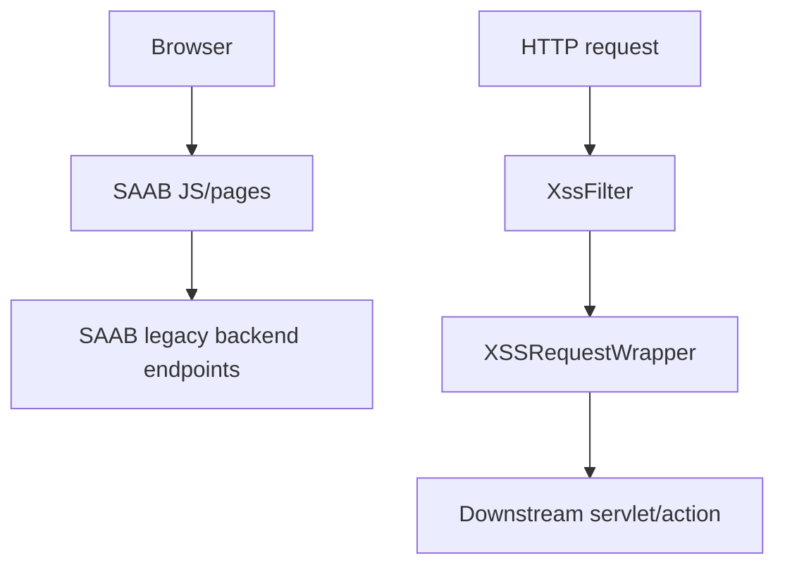

# psaab 模組功用、資料流與牽涉程式

## 專案定位

psaab 是 SAAB 類 legacy web 資產與少量 Java filter 專案。CodeGraph 顯示大多數是 JavaScript，Java 只有 XSS filter/wrapper 類，表示它比較像 SAAB 前端/模板/靜態資產與安全 filter 片段，而非完整大型後端。

CodeGraph 本輪確認：140 indexed files, 541 nodes；JavaScript 138、Java 2。

## 模組功用與牽涉程式

| 模組 | 功用 | 牽涉程式/路徑 |
|---|---|---|
| XSS filter | 對 request parameter/header 做 pattern strip，再包裝 request | src/main/java/com/tradevan/saab/filter/XssFilter.java；XSSRequestWrapper.java |
| User/Login JS | 使用者與登入畫面互動 | pages/user/js/user.js；pages/user/js/login.js |
| Org/Privilege/Log JS | 組織、權限、log 維護前端 | pages/org/js/org.js；pages/privilege/js/privilege.js；pages/log/js/log.js |
| SAAB common JS | 共用 ajax/dialog/date/string/number/validate | js/saab_ajax.js；saab_commons.js；saab_dialog.js；saab_validate.js |
| Menu/templates | Struts menu/coolmenus/cssMenu 模板 | templates/cssMenu.html；coolmenus.html；js/struts-menu/* |
| UI libraries | jQuery/jqGrid/jstree/calendar/uploadify | js/jquery；js/jstree；js/calendar；js/uploadify |

## 主要資料流

## 已驗證例子

| 功能 | 程式 | 觀察 |
|---|---|---|
| XSS 過濾 | XssFilter.doFilter() | chain.doFilter(new XSSRequestWrapper(request), response) |
| 參數清理 | XSSRequestWrapper.getParameter/getParameterValues/getHeader | 以 script/eval/expression/javascript/vbscript/onload pattern 清理 |

## 盤點限制與下一步

目前 repo 內未看到完整 SAAB Action/Service 後端，重點應放在前端資產與 filter 是否被其他系統引用。下一步可查 web.xml 或部署包中的 filter mapping 與頁面引用。
