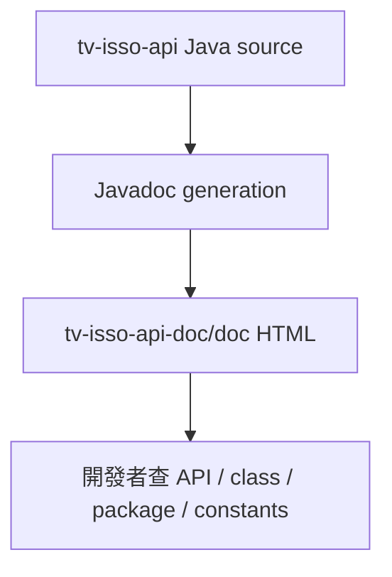

# tv-isso-api-doc 模組功用、資料流與牽涉程式

## 專案定位

tv-isso-api-doc 是 tv-isso-api 的 Javadoc/HTML 文件輸出，不是 runtime Java 專案。CodeGraph 已初始化但 indexed files 為 0，這符合文件輸出型專案的特性，不應解讀成程式索引壞掉。

CodeGraph 本輪確認：0 indexed files, 0 nodes；檔案主要位於 doc/*.html、doc/com/tradevan/isso/ext/**/*.html、stylesheet.css、index-files。

## 模組功用與牽涉檔案

| 模組 | 功用 | 牽涉檔案 |
|---|---|---|
| Javadoc 首頁 | 文件入口、frame/no-frame 首頁、overview | doc/index.html；overview-summary.html；overview-frame.html；overview-tree.html |
| Package 文件 | 依 Java package 顯示 summary/tree/use/frame | doc/com/tradevan/isso/ext/package-summary.html；bean/package-summary.html；service/package-summary.html；model/package-summary.html；util/package-summary.html |
| Class 文件 | 對應 tv-isso-api 的 class/API 說明 | ApContext.html；PermissionConfig.html；ISSOUser.html；IssoAnnouncementDO.html；AnnouncementService.html；IssoAnnouncementModel.html |
| class-use | 類別使用關係文件 | doc/com/tradevan/isso/ext/**/class-use/*.html |
| Index/deprecated/constants | 全文索引、deprecated list、常數值 | doc/index-files/*.html；deprecated-list.html；constant-values.html |
| 靜態資產 | Javadoc 樣式與圖示 | stylesheet.css；resources/inherit.gif |

## 文件資料流

## 與 tv-isso-api 對應

| 文件頁 | 對應 source |
|---|---|
| doc/com/tradevan/isso/ext/service/AnnouncementService.html | tv-isso-api/src/main/java/com/tradevan/isso/ext/service/AnnouncementService.java |
| doc/com/tradevan/isso/ext/bean/IssoAnnouncementDO.html | tv-isso-api/src/main/java/com/tradevan/isso/ext/bean/IssoAnnouncementDO.java |
| doc/com/tradevan/isso/ext/bean/ISSOUser.html | tv-isso-api/src/main/java/com/tradevan/isso/ext/bean/ISSOUser.java |
| doc/com/tradevan/isso/ext/model/IssoAnnouncementModel.html | tv-isso-api/src/main/java/com/tradevan/isso/ext/model/IssoAnnouncementModel.java |

## 盤點限制與下一步

此專案不適合追 controller/service/DAO 執行流，應與 tv-isso-api source 搭配閱讀。
下一步可補「文件頁 -> source class -> 主要方法」對照，作為維護 tv-isso-api 的查閱索引。
