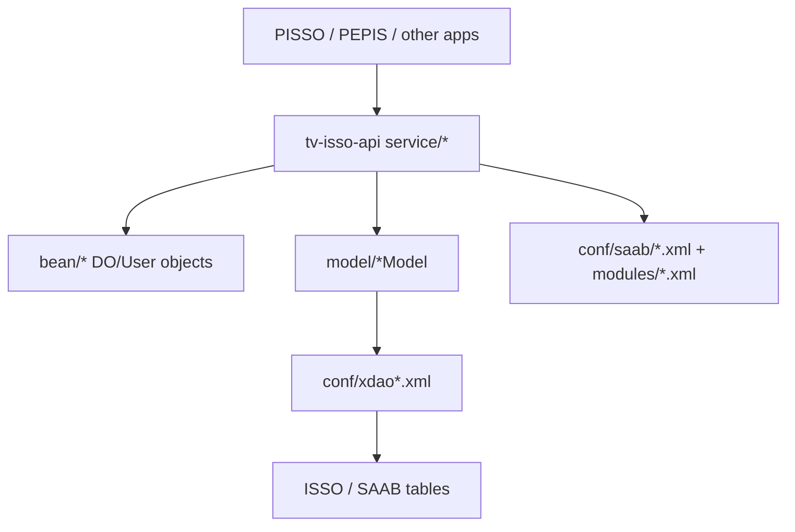

# tv-isso-api 模組功用、資料流與牽涉程式

## 專案定位

tv-isso-api 是 ISSO/SAAB 共用 Java library/jar，提供使用者、組織、公告、授權、代碼、信箱/box、billing 等共用 API。它不是網頁入口，而是被 PISSO、PEPIS 等系統引用的共享服務與資料模型層。

CodeGraph 本輪確認：33 indexed files, 632 nodes；全部為 Java。

## 模組功用與牽涉程式

| 模組 | 功用 | 牽涉程式/路徑 |
|---|---|---|
| Context/base | 共用 context、logger、default action/model、常數 | ApContext.java；ApLogger.java；Constant.java；DefaultAction.java；DefaultModel.java；PageAction.java |
| 使用者模型 | 建立/轉換 ISSO user，產生預設 user id | bean/ISSOUser.java；getDefaultId(extId, customId) -> N_extId_customId |
| 組織/帳務/box bean | 組織擴充、SR、billing、box、code data 等 DO/bean | ISSOOrgSRInfo.java；ISSOOrgExtInfo.java；ISSOOrgBilling.java；ISSOBillingInfo.java；IssoBoxDataDO.java；IssoCodeDataDO.java |
| 公告 DO/service/model | 定義公告欄位、priority、查詢登入/APP 公告 | bean/IssoAnnouncementDO.java；service/AnnouncementService.java；model/IssoAnnouncementModel.java |
| User/Org/Code/Box/Billing service | 提供各資料域共用服務 | service/UserDataService.java；OrgDataService.java；CodeDataService.java；BoxDataService.java |
| 授權 service | ISSO 管理帳號、使用者授權建立與檢核 | service/AuthorizeService.java；PermissionConfig.java |
| model/xdao | 對應 ISSO/SAAB 資料表與 xdao | model/*.java；resources/conf/xdao.xml；xdao_sql.xml；xdao_var.xml |
| SAAB config | SAAB context、SQL template、modules 設定 | conf/saab/saab_context.xml；saab_api_sql.xml；conf/modules/app.xml；appUrl.xml；orgMtn.xml；userMtn.xml |

## 主要資料流

## 公告資料流重點

| 方法 | 條件/意義 |
|---|---|
| AnnouncementService.getLoginAnnouncement(orgId) | 建立 cond：APP_ID=TDIS、ORG_ID=* 或 orgId、PRIORITY=T；用於登入頁 top 公告 |
| AnnouncementService.getAPPAnnouncement(appId, ISSOUser) | 查 APP 公告，依 appId 與 user org，查 PRIORITY=H/N |
| IssoAnnouncementModel.TABLE_ANNOUNCEMENT | 實表常數為 ISSO_ANNOUNCEMENT |
| IssoAnnouncementDO | 欄位包含 APP_ID、ORG_ID、BUILD_DATE、PRIORITY、CONTENT、START_DATE、END_DATE、ATTACH、ATTACH_NAME、IS_HIGHLIGHT |

## 盤點限制與下一步

pom.xml 先前曾在全專案分析中記錄有 XML 結構異常，因此此文件以 raw source 與 CodeGraph Java 類別為主，不以 XML parser 的 pom 結果當唯一證據。
下一步應對每個 consumer repo 建立「呼叫 tv-isso-api 方法 -> 實際條件 -> 影響資料表」矩陣，特別區分登入公告 T 與 APP 公告 H/N。
